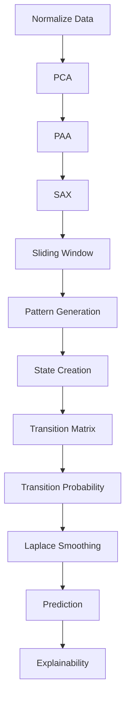
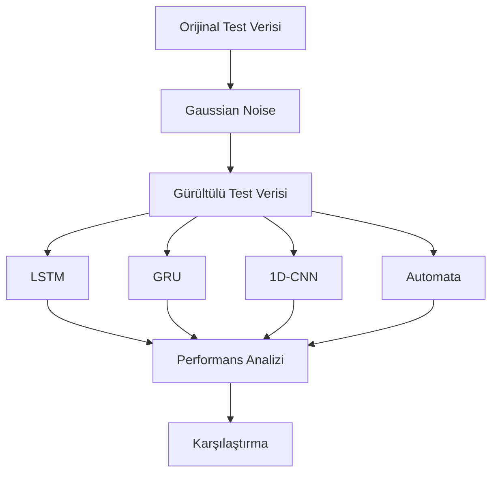

# YAZLAB2 - Açıklanabilir Zaman Serisi Analizi

---

## Proje Özeti

Bu projede zaman serileri üzerinde **anomali tespiti (Anomaly Detection)** gerçekleştirilmiştir.

Çalışmanın temel amacı;

- Deep Learning tabanlı black-box modelleri
- Probabilistic Automata tabanlı açıklanabilir modeli

performans, dayanıklılık ve yorumlanabilirlik açısından karşılaştırmaktır.

Geliştirilen sistem yalnızca anomali tespiti yapmakla kalmamakta, aynı zamanda verdiği kararların nedenlerini açıklayabilmektedir.

---

## Ekip

| Ad Soyad | Öğrenci No |
|-----------|-----------|
| Yasemin ATİŞ | 231307023 |
| Şenay CENGİZ | 231307027 |

---

# Proje Amacı

Bu çalışma kapsamında zaman serisi anomaly detection problemi üzerinde farklı yaklaşımlar karşılaştırılmıştır.

## Deep Learning Modelleri

- LSTM
- GRU
- 1D-CNN

## Açıklanabilir Yaklaşım

- PCA
- PAA
- SAX
- Sliding Window
- Probabilistic Automata
- Levenshtein Distance
- Explainability Analysis

Amaç yalnızca yüksek doğruluk elde etmek değil, aynı zamanda model kararlarının neden üretildiğini açıklayabilmektir.

---

# Kullanılan Veri Setleri

| Veri Seti | Açıklama |
|------------|------------|
| BATADAL Training Dataset 2 | Su dağıtım sistemi sensör verileri |
| SKAB | Endüstriyel sensör verileri |

---

# Veri Seti Özeti

| Özellik | BATADAL | SKAB |
|----------|----------:|----------:|
| Satır Sayısı | 4177 | 22474 |
| Kolon Sayısı | 45 | 13 |
| Feature Sayısı | 43 | 8 |
| Label | ATT_FLAG | anomaly |
| Anomaly Oranı | %5.24 | %34.82 |
| Veri Yapısı | Tek CSV | Çoklu CSV |
| Bölme Yöntemi | Zaman Sıralı Split | GroupKFold |

---

# Proje Mimarisi

```text
Raw Data
   │
   ▼
Normalization
   │
   ▼
PCA
   │
   ▼
PAA
   │
   ▼
SAX
   │
   ▼
Sliding Window
   │
   ▼
State Generation
   │
   ▼
Transition Matrix
   │
   ▼
Transition Probability
   │
   ▼
Prediction
   │
   ▼
Explainability
```

---

# Kurulum

```bash
git clone https://github.com/kullaniciadi/yazlab2-aciklanabilir-zaman-serisi-analizi.git

cd yazlab2-aciklanabilir-zaman-serisi-analizi

python -m venv .venv

source .venv/bin/activate

pip install -r requirements.txt
```

---

# Kullanılan Teknolojiler

- Python
- Pandas
- NumPy
- Scikit-Learn
- PyTorch
- Matplotlib
- Seaborn
- NetworkX
- Pytest

---

# Veri Ön İşleme Süreci

Modelleme öncesinde aşağıdaki işlemler uygulanmıştır.

1. Veri Okuma
2. Train / Validation / Test Ayrımı
3. StandardScaler ile Normalizasyon
4. PCA ile Boyut İndirgeme
5. PAA Dönüşümü
6. SAX Dönüşümü
7. Sliding Window
8. Pattern Üretimi
9. State Oluşturma
10. Transition Analizi

Veri sızıntısını önlemek amacıyla tüm dönüşümler yalnızca train verisi üzerinde öğrenilmiş ve test verisine yalnızca transform uygulanmıştır.

---

# Veri Bölme Stratejisi

## BATADAL

| Bölüm | Oran | Satır |
|---------|---------:|---------:|
| Train | %60 | 2506 |
| Validation | %20 | 835 |
| Test | %20 | 836 |

### Not

- Shuffle uygulanmamıştır.
- Zaman sırası korunmuştur.

---

## SKAB

SKAB veri setinde GroupKFold yaklaşımı kullanılmıştır.

| Fold | Train | Test |
|---------|---------:|---------:|
| Fold 1 | 17962 | 4512 |
| Fold 2 | 17981 | 4493 |
| Fold 3 | 17982 | 4492 |
| Fold 4 | 18040 | 4434 |
| Fold 5 | 17931 | 4543 |

### Not

- Aynı kaynak dosya hem train hem test içerisinde bulunmamaktadır.
- Veri sızıntısı engellenmiştir.

---

# Kullanılan Modeller

Bu proje kapsamında Deep Learning tabanlı modeller ile açıklanabilir bir Probabilistic Automata yaklaşımı karşılaştırılmıştır.

## Deep Learning Modelleri

| Model | Tür | Açıklama |
|---------|---------|---------|
| LSTM | Deep Learning | Uzun dönem bağımlılıkları öğrenebilen recurrent neural network |
| GRU | Deep Learning | LSTM'e göre daha hafif ve hızlı recurrent yapı |
| 1D-CNN | Deep Learning | Yerel zaman serisi örüntülerini öğrenen convolutional yapı |

---

## Açıklanabilir Model

| Model | Tür | Açıklama |
|---------|---------|---------|
| Probabilistic Automata | Explainable AI | State ve transition probability tabanlı açıklanabilir model |

---

# Deep Learning Eğitim Parametreleri

| Parametre | Değer |
|------------|------------:|
| Epoch | 50 |
| Batch Size | 32 |
| Learning Rate | 0.001 |
| Early Stopping | 5 |
| Optimizer | Adam |
| Loss Function | BCEWithLogitsLoss |

---

# Açıklanabilir Automata Yaklaşımı

Bu çalışmada PCA ile tek boyuta indirgenen zaman serileri sembolik hale getirilerek açıklanabilir bir otomata modeli oluşturulmuştur.

## Dönüşüm Zinciri

```text
PCA
 ↓
PAA
 ↓
SAX
 ↓
Sliding Window
 ↓
Pattern Üretimi
 ↓
State Oluşturma
 ↓
Transition Matrix
 ↓
Transition Probability
 ↓
Prediction
 ↓
Explainability
```

---

## Automata Model Akışı



---

## Transition Probability Hesaplama

State geçiş olasılıkları aşağıdaki yöntem ile hesaplanmıştır.

```text
P(Si → Sj)

=
Transition Count

/

Total Outgoing Count
```

Sıfır olasılık problemini azaltmak amacıyla Laplace Smoothing uygulanmıştır.

---

# Unseen Pattern Yönetimi

Model eğitim sırasında görülmeyen patternleri yönetebilmek için Levenshtein Distance kullanmaktadır.

## İşleyiş

1. Gelen pattern sözlükte aranır.
2. Bulunursa doğrudan kullanılır.
3. Bulunamazsa unseen olarak işaretlenir.
4. Levenshtein Distance hesaplanır.
5. En yakın pattern bulunur.
6. Mapping işlemi gerçekleştirilir.
7. Tahmin üretilir.

---

## Örnek

```text
Train Pattern : abc

Incoming Pattern : abd

Distance = 1

abd → abc
```

---

# Explainability Çıktıları

Automata modeli kararlarını açıklayabilmektedir.

Örnek açıklama çıktısı:

```json
{
  "pattern": "aaaac",
  "mapped_to": "aaaa",
  "distance": 1,
  "decision": "anomaly",
  "confidence_score": 0.5
}
```

Bu sayede modelin hangi pattern nedeniyle anomali kararı verdiği takip edilebilmektedir.

---

# Testler

Proje kapsamında veri ön işleme, automata oluşturma, tahmin sistemi, unseen pattern yönetimi, açıklanabilirlik ve derin öğrenme bileşenleri için birim testler geliştirilmiştir.

Tüm testleri çalıştırmak için:

```bash
python -m pytest tests
```

Belirli testleri çalıştırmak için:

```bash
python -m pytest tests/test_transition_analysis.py

python -m pytest tests/test_automata_predict.py

python -m pytest tests/test_levenshtein.py
```

## Test Sonuçları

Aşağıdaki çıktı proje kapsamında geliştirilen testlerin başarıyla çalıştığını göstermektedir.

- Toplam Test Sayısı: **47**
- Başarılı Test Sayısı: **47**
- Başarı Oranı: **%100**

<p align="center">

</p>

*Pytest çıktısı (47/47 test başarılı).*

---

# Normal Veri Senaryosu Sonuçları

Bu senaryoda modeller orijinal veri üzerinde değerlendirilmiştir.

## SKAB Sonuçları

| Model | Accuracy | Precision | Recall | F1-score |
|---------|---------:|---------:|---------:|---------:|
| LSTM | 0.674 | 0.668 | 0.093 | 0.149 |
| GRU | 0.676 | 0.592 | 0.122 | 0.187 |
| 1D-CNN | 0.678 | 0.637 | 0.139 | 0.215 |
| Automata | 0.567 | 0.308 | 0.118 | 0.156 |

---

## BATADAL Sonuçları

| Model | Accuracy | Precision | Recall | F1-score |
|---------|---------:|---------:|---------:|---------:|
| LSTM | 0.904 | 0.000 | 0.000 | 0.000 |
| GRU | 0.904 | 0.000 | 0.000 | 0.000 |
| 1D-CNN | 0.904 | 0.000 | 0.000 | 0.000 |
| Automata | 0.671 | 0.308 | 0.500 | 0.381 |

---

# Confusion Matrix

Aşağıdaki confusion matrix automata modelinin sınıflandırma performansını göstermektedir.

<p align="center">

</p>

---

# Precision Recall Curve

Precision ve Recall arasındaki ilişki aşağıdaki grafikte gösterilmiştir.

<p align="center">

</p>

---

## Normal Veri Sonuçlarının Değerlendirilmesi

- Deep Learning modelleri daha yüksek accuracy değerleri üretmiştir.
- CNN modeli SKAB veri setinde en yüksek F1 skoruna ulaşmıştır.
- BATADAL veri setinde sınıf dengesizliği nedeniyle deep learning modelleri anomaly sınıfını yakalamakta zorlanmıştır.
- Automata modeli daha düşük doğruluk üretmesine rağmen karar mekanizmasını açıklayabilmektedir.
- Explainability açısından automata yaklaşımı önemli avantajlar sunmaktadır.

---

# Gürültü (Noise) Senaryosu

Modellerin veri bozulmalarına karşı dayanıklılığını ölçmek amacıyla test verilerine Gaussian Noise eklenmiştir.

## Uygulanan Yaklaşım

- Eğitim verileri değiştirilmemiştir.
- Modeller yeniden eğitilmemiştir.
- Yalnızca test verilerine gürültü eklenmiştir.
- Performans kayıpları incelenmiştir.

## Gürültü Senaryosu Akışı



---

## Gürültü Senaryosu Değerlendirmesi

- Gürültü eklenmesi tüm modellerde performans düşüşüne neden olmuştur.
- Deep Learning modelleri gürültüden etkilenmiştir.
- Automata modeli sembolik dönüşüm nedeniyle belirli seviyeye kadar dayanıklılık göstermiştir.
- Gürültü arttıkça transition yapılarında bozulmalar gözlemlenmiştir.

---

# Unseen Veri Senaryosu

Bu deneyde eğitim sırasında görülmeyen yeni patternler oluşturulmuştur.

Amaç modelin daha önce karşılaşmadığı örüntüler karşısındaki davranışını incelemektir.

---

## SKAB Sonuçları

| Model | Accuracy | Precision | Recall | F1-score |
|---------|---------:|---------:|---------:|---------:|
| LSTM | 0.674 | 0.668 | 0.093 | 0.149 |
| GRU | 0.676 | 0.592 | 0.122 | 0.187 |
| 1D-CNN | 0.678 | 0.637 | 0.139 | 0.215 |
| Automata | 1.000 | 1.000 | 1.000 | 1.000 |

---

## BATADAL Sonuçları

| Model | Accuracy | Precision | Recall | F1-score |
|---------|---------:|---------:|---------:|---------:|
| Automata | 1.000 | 1.000 | 1.000 | 1.000 |

---

## Değerlendirme

- Automata modeli unseen patternleri başarılı şekilde tespit etmiştir.
- Levenshtein Distance mekanizması yeni patternlerin eşlenmesini sağlamıştır.
- Karar süreci explainability çıktılarıyla açıklanabilmiştir.

---

# Explainability Analizi

Automata modelinin yorumlanabilirliği state ve transition yapıları üzerinden incelenmiştir.

---

## Automata State Diagram

Aşağıdaki grafik automata tarafından öğrenilen durumları ve geçişleri göstermektedir.

<p align="center">

</p>

---

## Transition Probability Heatmap

Geçiş olasılıklarının yoğunluğu aşağıdaki heatmap üzerinde gösterilmiştir.

<p align="center">

</p>

---

## Explainability Değerlendirmesi

Automata modeli:

- State bazlı çalışmaktadır.
- Geçiş olasılıklarını raporlayabilmektedir.
- Unseen patternleri açıklayabilmektedir.
- Karar sürecini JSON çıktıları ile sunabilmektedir.

Bu özellikler deep learning modellerine kıyasla önemli yorumlanabilirlik avantajları sağlamaktadır.

---

# Parametre Duyarlılık Analizi

Parametre değişimlerinin model performansı üzerindeki etkileri incelenmiştir.

---

# Window Size Analizi

## Sonuçlar

| Window Size | Dataset | Accuracy | Precision | Recall | F1-score |
|------------:|----------|----------:|----------:|----------:|----------:|
| 3 | SKAB | 0.608 | 0.287 | 0.085 | 0.125 |
| 4 | SKAB | 0.600 | 0.276 | 0.104 | 0.137 |
| 5 | SKAB | 0.594 | 0.263 | 0.106 | 0.130 |
| 6 | SKAB | 0.588 | 0.246 | 0.112 | 0.129 |

---

### SKAB

<p align="center">

</p>

---

### BATADAL

<p align="center">

</p>

---

### Değerlendirme

- Window size arttıkça state sayısı artmıştır.
- Transition yoğunluğu azalmıştır.
- Model karmaşıklığı yükselmiştir.
- En dengeli sonuçlar window size = 4 için elde edilmiştir.

---

# Alphabet Size Analizi

## Sonuçlar

| Alphabet Size | Dataset | Accuracy | Precision | Recall | F1-score |
|--------------:|----------|----------:|----------:|----------:|----------:|
| 3 | SKAB | 0.600 | 0.276 | 0.104 | 0.137 |
| 4 | SKAB | 0.615 | 0.334 | 0.097 | 0.148 |
| 5 | SKAB | 0.613 | 0.343 | 0.116 | 0.170 |
| 6 | SKAB | 0.600 | 0.299 | 0.110 | 0.157 |

---

### SKAB

<p align="center">

</p>

---

### BATADAL

<p align="center">

</p>

---

### Değerlendirme

- Alphabet size arttıkça pattern çeşitliliği yükselmiştir.
- State sayısı artmıştır.
- Çok büyük alphabet değerlerinde performans düşüşü gözlemlenmiştir.
- En yüksek F1 skorları alphabet size = 5 civarında elde edilmiştir.

---

# Cross Dataset Analizi

Bu deneyde modelin farklı veri setlerine genellenebilirliği incelenmiştir.

| Kaynak Veri Seti | Hedef Veri Seti | Accuracy | Precision | Recall | F1-score |
|------------------|----------------|----------:|----------:|----------:|----------:|
| SKAB | BATADAL | 0.519 | 0.104 | 0.477 | 0.170 |
| BATADAL | SKAB | 0.590 | 0.362 | 0.170 | 0.222 |

---

## Değerlendirme

- Veri setleri arasında doğrudan transfer başarısı sınırlı kalmıştır.
- Sensör yapılarındaki farklılıklar performansı etkilemiştir.
- Automata modeli kısmi genellenebilirlik göstermiştir.

---

# İstatistiksel Analiz

Deneyler farklı random seed değerleri ile tekrar çalıştırılmıştır.

## Kullanılan Seed Değerleri

```text
42
123
2026
7
999
```

---

## Ortalama Sonuçlar

| Dataset | Accuracy Mean | Accuracy Std | Precision Mean | Recall Mean | F1-score Mean |
|----------|----------:|----------:|----------:|----------:|----------:|
| BATADAL | 0.780 | 0.000 | 0.047 | 0.058 | 0.052 |
| SKAB | 0.600 | 0.029 | 0.276 | 0.104 | 0.137 |

---

## Wilcoxon Testi

```text
p-value = 0.0625
```

### Sonuç

- İstatistiksel olarak anlamlı fark gözlemlenmemiştir.
- Deneyler kararlı sonuçlar üretmiştir.
- Farklı seed değerlerinde benzer performans elde edilmiştir.

---

# Genel Sonuç

Bu proje kapsamında:

- LSTM
- GRU
- 1D-CNN
- Probabilistic Automata

yaklaşımları karşılaştırılmıştır.

Deep Learning modelleri daha yüksek doğruluk değerleri üretebilmesine rağmen karar mekanizmaları doğrudan yorumlanamamaktadır.

Probabilistic Automata yaklaşımı ise:

- State yapıları
- Transition olasılıkları
- Pattern tabanlı karar mekanizması
- Unseen pattern yönetimi
- Levenshtein Distance
- Explainability çıktıları

sayesinde karar sürecini açıklanabilir hale getirmiştir.

Çalışma sonucunda açıklanabilir yapay zeka perspektifinden Probabilistic Automata yaklaşımının önemli avantajlar sunduğu görülmüştür.
