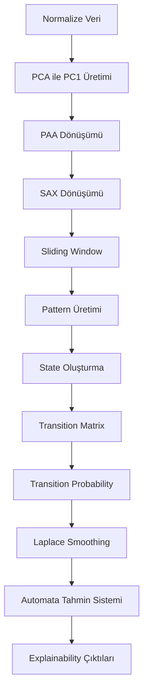
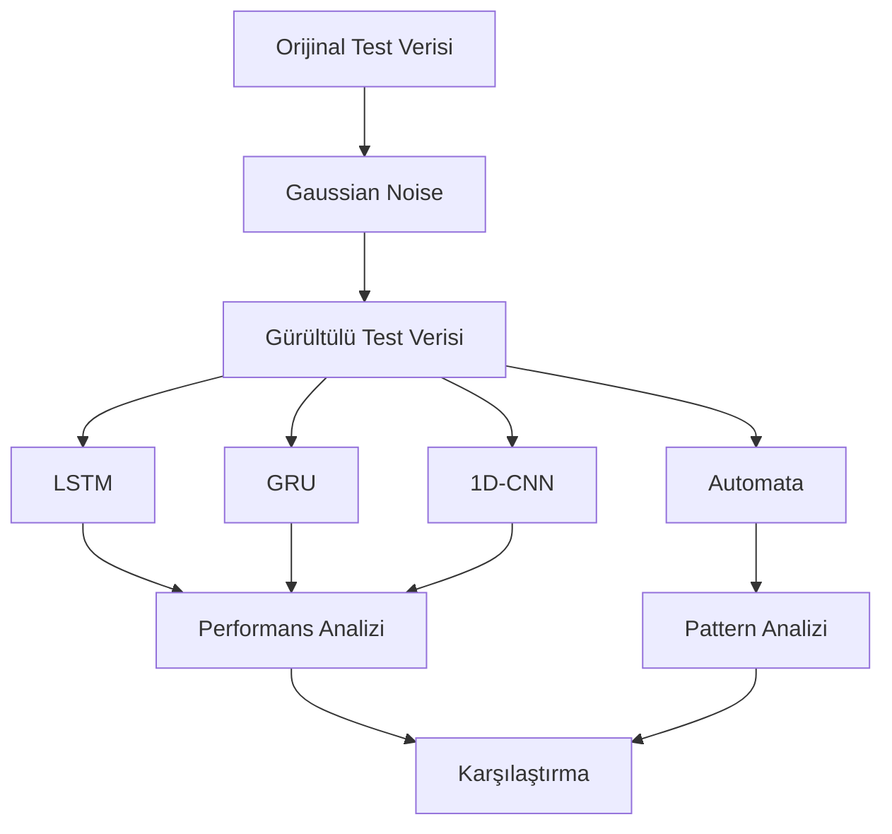
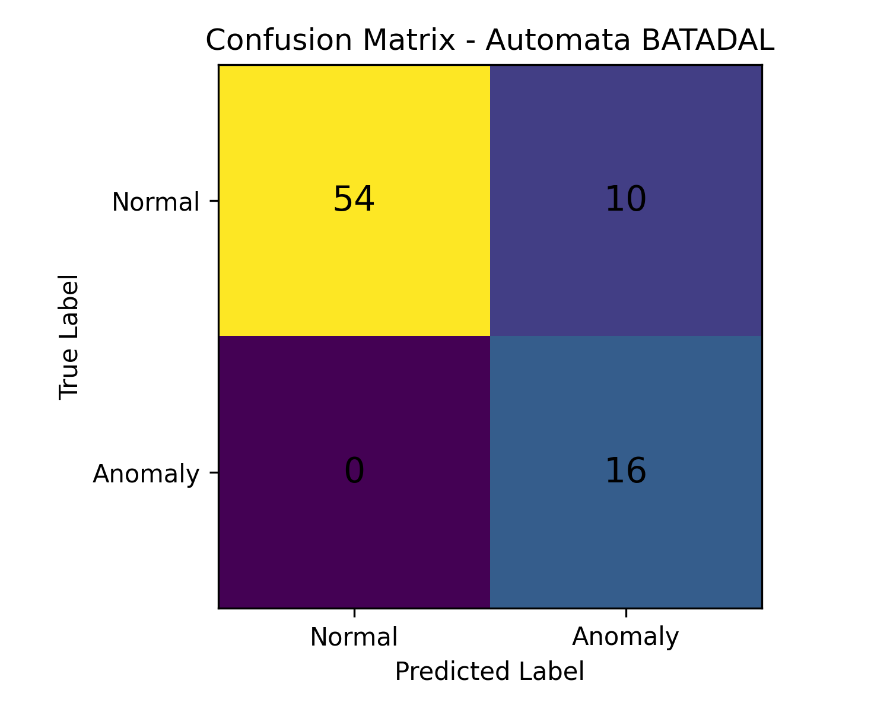
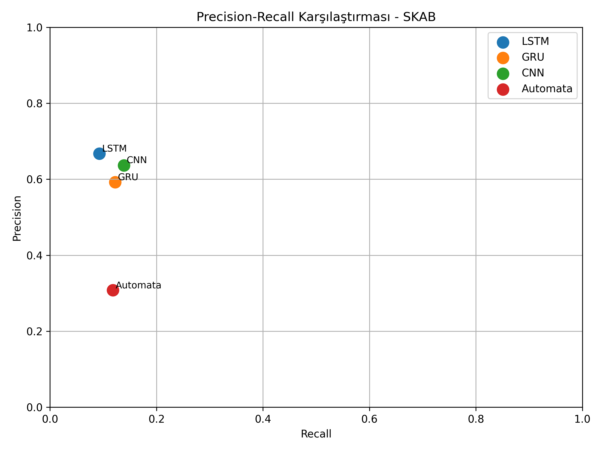
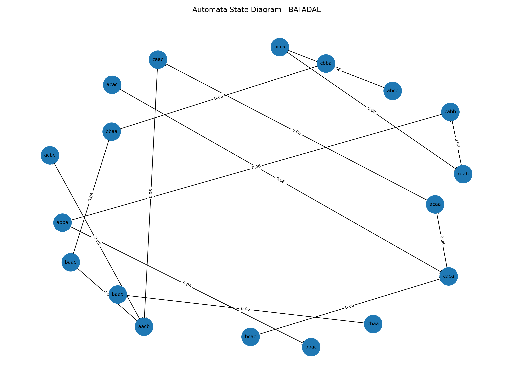
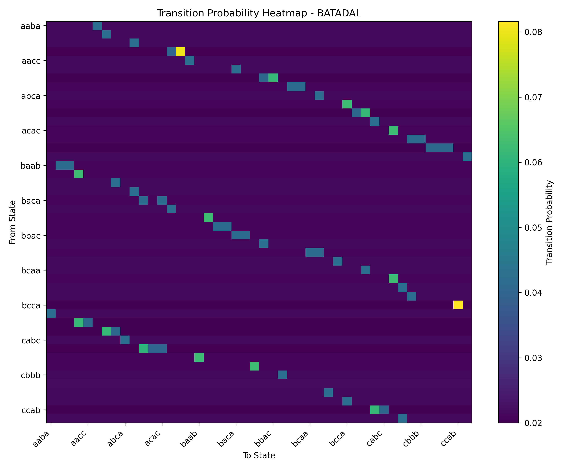
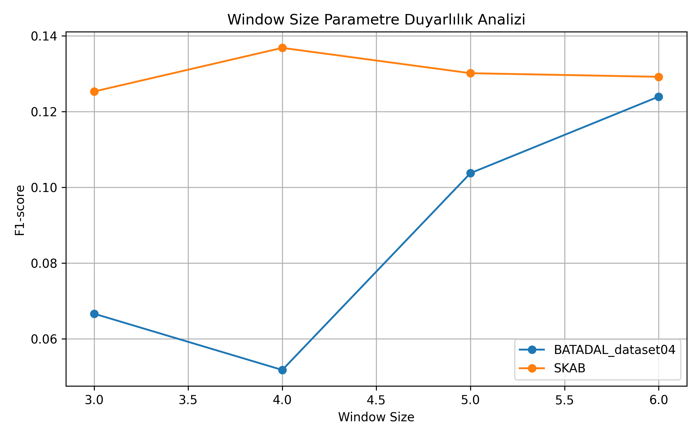
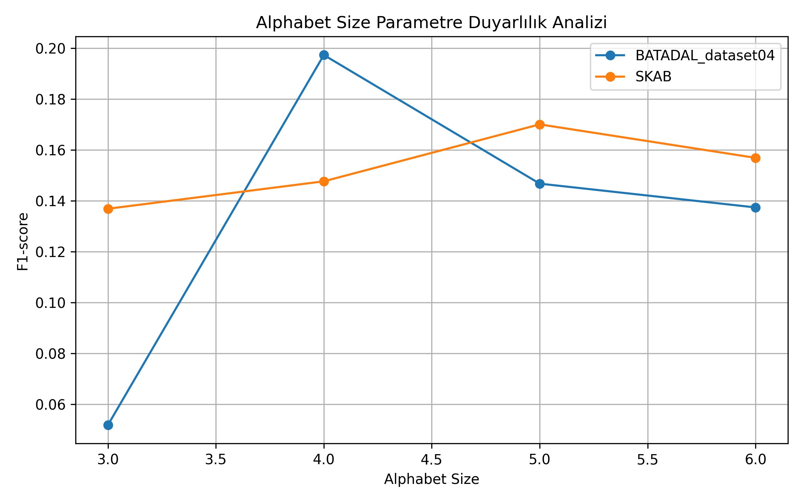

# YAZLAB2 - Açıklanabilir Zaman Serisi Analizi

Bu projede zaman serisi verileri üzerinde **anomali tespiti** yapılmıştır. Amaç, derin öğrenme tabanlı black-box modeller ile olasılıksal otomata tabanlı açıklanabilir bir yaklaşımın performans ve yorumlanabilirlik açısından karşılaştırılmasıdır.

---

## Ekip

| Ad Soyad | Öğrenci No |
|---|---|
| Yasemin ATİŞ | 231307023 |
| Şenay CENGİZ | 231307027 |

---

## Proje Amacı

Bu çalışmada zaman serisi anomaly detection problemi üzerinde farklı yaklaşımlar karşılaştırılmıştır.

Kullanılan yöntemler:

- LSTM
- GRU
- 1D-CNN
- PCA
- PAA
- SAX
- Sliding Window
- Olasılıksal Automata
- Levenshtein Distance
- Explainability Analizi

Amaç yalnızca yüksek doğruluk elde etmek değil, aynı zamanda model kararlarının yorumlanabilirliğini incelemektir.

---

## Kullanılan Veri Setleri

| Veri Seti | Açıklama |
|---|---|
| BATADAL Training Dataset 2 | Su dağıtım sistemi sensör verileri |
| SKAB | Endüstriyel sensör verileri |

---

## Veri Seti Özeti

| Özellik | BATADAL | SKAB |
|---|---:|---:|
| Satır Sayısı | 4177 | 22474 |
| Kolon Sayısı | 45 | 13 |
| Feature Sayısı | 43 | 8 |
| Label | ATT_FLAG | anomaly |
| Anomaly Oranı | %5.24 | %34.82 |
| Veri Yapısı | Tek CSV | Çoklu CSV |
| Bölme Yöntemi | Zaman Sıralı Split | GroupKFold |

---

## Proje Yapısı

```text
YAZLAB2-ACIKLANABILIR-ZAMAN-SERISI-ANALIZI
│
├── config/
│   └── config.py
│
├── data/
│   ├── raw/                    # Ham veri setleri
│   ├── processed/              # PCA, PAA, SAX çıktıları
│   └── noisy/                  # Gürültü eklenmiş veriler
│
├── logs/
│   ├── cnn/
│   ├── preprocessing_*.log
│   ├── parameter_analysis_experiment.log
│   ├── cross_dataset_analysis_experiment.log
│   └── statistical_analysis_experiment.log
│
├── models/
│   ├── cnn/
│   ├── gru/
│   ├── lstm/
│   ├── pca/
│   └── scalers/
│
├── results/
│   ├── automata_normal_data/
│   ├── automata_noisy_data/
│   ├── comparison/
│   ├── cross_dataset_analysis/
│   ├── figures/
│   ├── metrics/
│   ├── noise/
│   ├── normal_data/
│   ├── parameter_analysis/
│   ├── plots/
│   ├── statistical_analysis/
│   ├── transition_matrices/
│   ├── transition_probabilities/
│   ├── unseen/
│   ├── all_model_results.csv
│   └── pattern_count_analysis.csv
│
├── src/
│   │
│   ├── Veri Ön İşleme
│   │   ├── split_data.py
│   │   ├── normalization.py
│   │   ├── pca_transform.py
│   │   ├── preprocessing_pipeline.py
│   │   └── prepare_skab_dataset.py
│   │
│   ├── Sembolik Dönüşümler
│   │   ├── paa_transform.py
│   │   ├── sax_transform.py
│   │   ├── sliding_window.py
│   │   └── pattern_analysis.py
│   │
│   ├── Automata Sistemi
│   │   ├── automata_builder.py
│   │   ├── transition_analysis.py
│   │   ├── automata_predict.py
│   │   ├── unseen_mapper.py
│   │   ├── unseen_pattern_checker.py
│   │   └── levenshtein.py
│   │
│   ├── Derin Öğrenme
│   │   ├── data_loader.py
│   │   ├── data_loader_torch.py
│   │   ├── train.py
│   │   ├── train_lstm.py
│   │   ├── train_gru.py
│   │   └── train_cnn.py
│   │
│   ├── Deneyler
│   │   ├── evaluate_normal_data.py
│   │   ├── evaluate_automata_normal_data.py
│   │   ├── add_noise.py
│   │   ├── evaluate_noisy_deep_learning.py
│   │   ├── evaluate_noisy_automata.py
│   │   ├── create_unseen_dataset.py
│   │   ├── evaluate_unseen_deep_learning.py
│   │   ├── evaluate_unseen_automata.py
│   │   └── compare_unseen_results.py
│   │
│   ├── Analizler
│   │   ├── parameter_analysis.py
│   │   ├── cross_dataset_analysis.py
│   │   ├── statistical_analysis.py
│   │   ├── collect_model_results.py
│   │   └── plot_training_history.py
│   │
│   └── Yardımcı Scriptler
│       ├── inspect_data.py
│       └── check_skab_features.py
│
├── tests/
│   ├── test_split_data.py
│   ├── test_normalization.py
│   ├── test_pca.py
│   ├── test_paa.py
│   ├── test_sliding_window.py
│   ├── test_pattern_analysis.py
│   ├── test_automata_builder.py
│   ├── test_transition_analysis.py
│   ├── test_automata_predict.py
│   ├── test_automata_predict_state_file.py
│   ├── test_automata_prediction_accuracy.py
│   ├── test_levenshtein.py
│   ├── test_lstm.py
│   ├── test_gru.py
│   ├── test_cnn.py
│   ├── test_training_pipeline.py
│   └── test_evaluation.py
│
├── requirements.txt
├── README.md
└── .gitignore
```

## Kurulum

```bash
git clone https://github.com/kullaniciadi/yazlab2-aciklanabilir-zaman-serisi-analizi.git

cd yazlab2-aciklanabilir-zaman-serisi-analizi

python -m venv .venv

source .venv/bin/activate

pip install -r requirements.txt
```

---

## Kullanılan Teknolojiler

- Python
- Pandas
- NumPy
- Scikit-Learn
- PyTorch
- Matplotlib
- Seaborn
- Pytest

---

## Veri Ön İşleme Süreci

Modelleme öncesinde aşağıdaki adımlar uygulanmıştır:

1. Veri okuma
2. Eksik veri kontrolü
3. Train / Validation / Test ayrımı
4. StandardScaler ile normalizasyon
5. PCA ile boyut indirgeme
6. PAA dönüşümü
7. SAX dönüşümü
8. Sliding Window
9. State ve Transition oluşturma

Veri sızıntısını önlemek amacıyla tüm dönüşümler yalnızca train verisi üzerinde öğrenilmiş ve test verisine sadece transform uygulanmıştır.

---

## Veri Bölme Stratejisi

### BATADAL

| Bölüm | Oran | Satır |
|---|---:|---:|
| Train | %60 | 2506 |
| Validation | %20 | 835 |
| Test | %20 | 836 |

Shuffle uygulanmamıştır.

### SKAB

GroupKFold yöntemi kullanılmıştır.

| Fold | Train | Test |
|---|---:|---:|
| Fold 1 | 17962 | 4512 |
| Fold 2 | 17981 | 4493 |
| Fold 3 | 17982 | 4492 |
| Fold 4 | 18040 | 4434 |
| Fold 5 | 17931 | 4543 |


---

## Kullanılan Modeller

| Model | Tür | Açıklama |
|---|---|---|
| LSTM | Deep Learning | Uzun dönem bağımlılıkları öğrenen RNN modeli |
| GRU | Deep Learning | Daha hafif ve hızlı recurrent model |
| 1D-CNN | Deep Learning | Lokal zaman serisi örüntülerini öğrenen model |
| Olasılıksal Automata | Açıklanabilir Model | State ve transition probability tabanlı model |

---

## Derin Öğrenme Eğitim Ayarları

| Parametre | Değer |
|---|---:|
| Epoch | 50 |
| Batch Size | 32 |
| Learning Rate | 0.001 |
| Early Stopping | 5 |
| Loss Function | BCEWithLogitsLoss |
| Optimizer | Adam |

---

## Açıklanabilir Automata Yaklaşımı

PCA sonrası elde edilen tek boyutlu zaman serileri aşağıdaki dönüşümlerden geçirilmiştir:

```text
PCA
↓
PAA
↓
SAX
↓
Sliding Window
↓
Pattern Üretimi
↓
State Oluşturma
↓
Transition Matrix
↓
Transition Probability
↓
Automata Tahmini
```

---

## Automata Model Akışı



---

## Transition Probability Hesaplama

State geçiş olasılıkları aşağıdaki formül ile hesaplanmıştır:

```text
P(Si → Sj) =
Geçiş Sayısı / Toplam Çıkış Sayısı
```

Sıfır olasılık problemini azaltmak için Laplace Smoothing uygulanmıştır.

---

## Unseen Pattern Yönetimi

Eğitim sırasında görülmeyen patternler için Levenshtein Distance kullanılmıştır.

İşleyiş:

1. Gelen pattern train sözlüğünde aranır.
2. Bulunursa doğrudan kullanılır.
3. Bulunmazsa unseen olarak işaretlenir.
4. Levenshtein Distance hesaplanır.
5. En yakın train pattern bulunur.
6. Mapping yapılır.
7. Karar üretilir.

Örnek:

```text
Gelen Pattern : abd
Train Pattern : abc

Distance = 1

Mapping:

abd → abc
```

---

## Açıklanabilirlik Çıktısı

Automata modeli kararlarını JSON formatında açıklayabilmektedir.

Örnek çıktı:

```json
{
  "pattern": "aaaac",
  "mapped_to": "aaaa",
  "distance": 1,
  "decision": "anomaly",
  "confidence_score": 0.5
}
```

Bu yapı sayesinde modelin neden anomaly kararı verdiği takip edilebilmektedir.

---

## Testler

Tüm testleri çalıştırmak için:

```bash
python -m pytest tests
```

Belirli testleri çalıştırmak için:

```bash
python -m pytest tests/test_transition_analysis.py

python -m pytest tests/test_automata_predict.py

python -m pytest tests/test_unseen_integration.py
```

---

## Normal Veri Senaryosu Sonuçları

### SKAB

| Model | Accuracy | Precision | Recall | F1-score |
|---|---:|---:|---:|---:|
| LSTM | 0.674 | 0.668 | 0.093 | 0.149 |
| GRU | 0.676 | 0.592 | 0.122 | 0.187 |
| 1D-CNN | 0.678 | 0.637 | 0.139 | 0.215 |
| Automata | 0.567 | 0.308 | 0.118 | 0.156 |

---

### BATADAL

| Model | Accuracy | Precision | Recall | F1-score |
|---|---:|---:|---:|---:|
| LSTM | 0.904 | 0.000 | 0.000 | 0.000 |
| GRU | 0.904 | 0.000 | 0.000 | 0.000 |
| 1D-CNN | 0.904 | 0.000 | 0.000 | 0.000 |
| Automata | 0.671 | 0.308 | 0.500 | 0.381 |

---

## Gürültü Senaryosu

Modellerin dayanıklılığını ölçmek amacıyla test verilerine Gaussian Noise eklenmiştir.

Bu süreçte:

- Eğitim verisi değiştirilmemiştir.
- Test verisi bozulmuştur.
- Modeller yeniden eğitilmemiştir.
- Gürültü altındaki performans değerlendirilmiştir.



---

## Unseen Veri Senaryosu Sonuçları

### SKAB Sonuçları

| Model | Accuracy | Precision | Recall | F1-score |
|---|---:|---:|---:|---:|
| LSTM | 0.674 | 0.668 | 0.093 | 0.149 |
| GRU | 0.676 | 0.592 | 0.122 | 0.187 |
| 1D-CNN | 0.678 | 0.637 | 0.139 | 0.215 |
| Automata | 1.000 | 1.000 | 1.000 | 1.000 |

---

### BATADAL Sonuçları

| Model | Accuracy | Precision | Recall | F1-score |
|---|---:|---:|---:|---:|
| Automata | 1.000 | 1.000 | 1.000 | 1.000 |

Automata modeli unseen patternleri başarıyla tespit etmiş ve karar sürecini açıklanabilir şekilde raporlamıştır.

---

## Parametre Duyarlılık Analizi

### Window Size Analizi

| Window Size | Dataset | Accuracy | Precision | Recall | F1-score |
|---:|---|---:|---:|---:|---:|
| 3 | SKAB | 0.608 | 0.287 | 0.085 | 0.125 |
| 4 | SKAB | 0.600 | 0.276 | 0.104 | 0.137 |
| 5 | SKAB | 0.594 | 0.263 | 0.106 | 0.130 |
| 6 | SKAB | 0.588 | 0.246 | 0.112 | 0.129 |

### Değerlendirme

- Window size arttıkça state sayısı artmıştır.
- Transition sayısı artmıştır.
- Transition yoğunluğu azalmıştır.
- Automata karmaşıklığı yükselmiştir.

---

### Alphabet Size Analizi

| Alphabet Size | Dataset | Accuracy | Precision | Recall | F1-score |
|---:|---|---:|---:|---:|---:|
| 3 | SKAB | 0.600 | 0.276 | 0.104 | 0.137 |
| 4 | SKAB | 0.615 | 0.334 | 0.097 | 0.148 |
| 5 | SKAB | 0.613 | 0.343 | 0.116 | 0.170 |
| 6 | SKAB | 0.600 | 0.299 | 0.110 | 0.157 |

### Değerlendirme

- Alphabet size arttıkça state sayısı artmıştır.
- Pattern çeşitliliği yükselmiştir.
- Çok yüksek alphabet değerlerinde performans düşmüştür.

---

## Cross Dataset Analizi

Bu deneyde modelin farklı veri setlerine genellenebilirliği incelenmiştir.

| Kaynak Veri Seti | Hedef Veri Seti | Accuracy | Precision | Recall | F1-score |
|---|---|---:|---:|---:|---:|
| SKAB | BATADAL | 0.519 | 0.104 | 0.477 | 0.170 |
| BATADAL | SKAB | 0.590 | 0.362 | 0.170 | 0.222 |

### Değerlendirme

- Veri setleri arasında doğrudan transfer başarısı sınırlı kalmıştır.
- Farklı sensör yapıları performansı etkilemiştir.
- Automata modeli kısmi genellenebilirlik göstermiştir.

---

## İstatistiksel Analiz

Deneyler aşağıdaki random seed değerleri ile tekrar çalıştırılmıştır:

```text
42
123
2026
7
999
```

### Ortalama Sonuçlar

| Dataset | Accuracy Mean | Accuracy Std | Precision Mean | Recall Mean | F1-score Mean |
|---|---:|---:|---:|---:|---:|
| BATADAL | 0.780 | 0.000 | 0.047 | 0.058 | 0.052 |
| SKAB | 0.600 | 0.029 | 0.276 | 0.104 | 0.137 |

---

### Wilcoxon Testi

```text
p-value = 0.0625
```

Sonuç:

- İstatistiksel olarak anlamlı fark gözlemlenmemiştir.
- Deney sonuçları kararlı davranış göstermiştir.

---

## Görseller

README içerisinde aşağıdaki görseller kullanılmalıdır.

### Confusion Matrix

```md

```

### ROC Curve

```md

```

### Precision Recall Curve

```md

```

### Automata State Diagram

```md

```

### Transition Probability Heatmap

```md

```

### Window Size Analizi

```md

```

### Alphabet Size Analizi

```md

```

---

## Kullanılan Teknolojiler

- Python 3
- Pandas
- NumPy
- Scikit-Learn
- PyTorch
- Matplotlib
- Seaborn
- NetworkX
- Pytest

---

## Genel Sonuç

Bu proje kapsamında:

- LSTM
- GRU
- 1D-CNN
- Olasılıksal Automata

yaklaşımları karşılaştırılmıştır.

Deep learning modelleri yüksek doğruluk değerleri üretebilmesine rağmen karar mekanizmaları doğrudan yorumlanamamaktadır.

Automata modeli ise:

- State yapıları
- Transition olasılıkları
- Unseen pattern yönetimi
- Levenshtein Distance
- Explainability çıktıları

sayesinde karar sürecini açıklanabilir hale getirmiştir.

Çalışma sonucunda olasılıksal automata yaklaşımının yalnızca performans açısından değil, aynı zamanda yorumlanabilirlik ve açıklanabilir yapay zeka perspektifinden de önemli avantajlar sunduğu görülmüştür.

---

## Katkıda Bulunanlar

- Yasemin ATİŞ - 231307023
- Şenay CENGİZ - 231307027

---

## Lisans

Bu proje Kocaeli Üniversitesi Bilişim Sistemleri Mühendisliği Yazılım Laboratuvarı II dersi kapsamında geliştirilmiştir.


