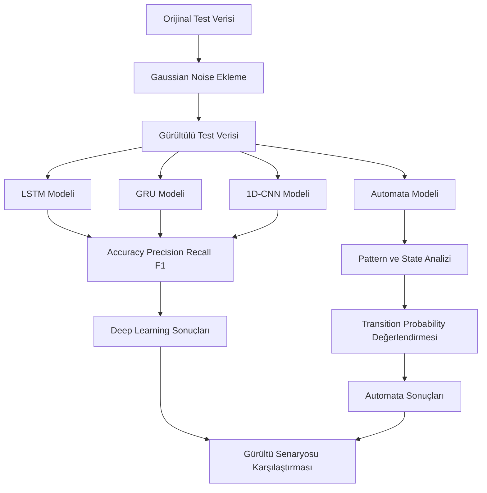
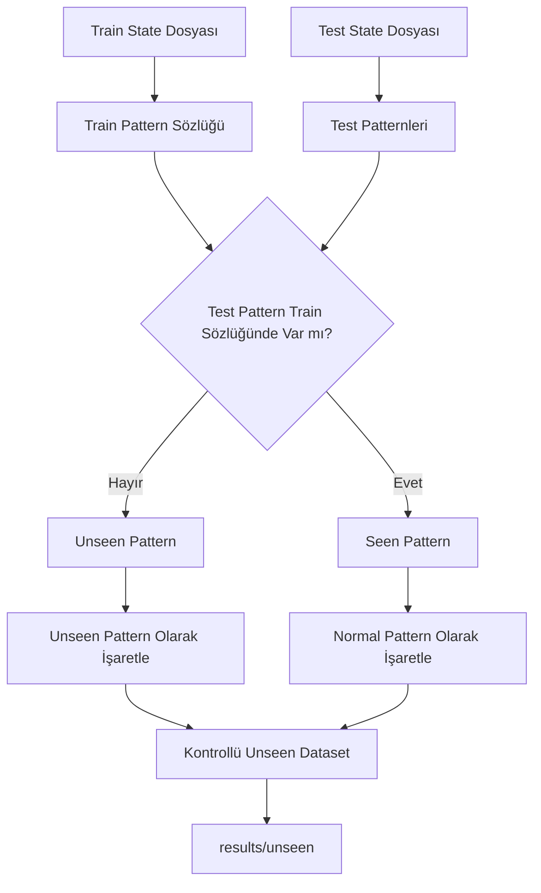
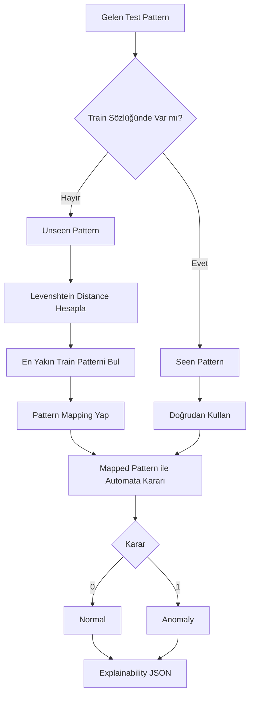
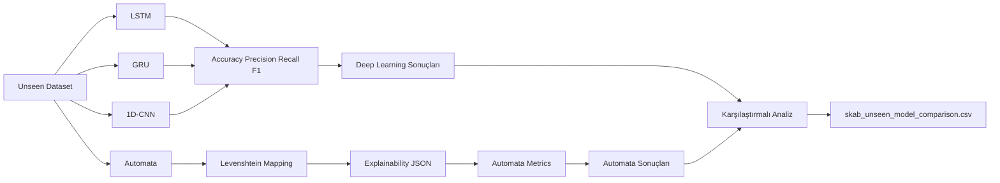
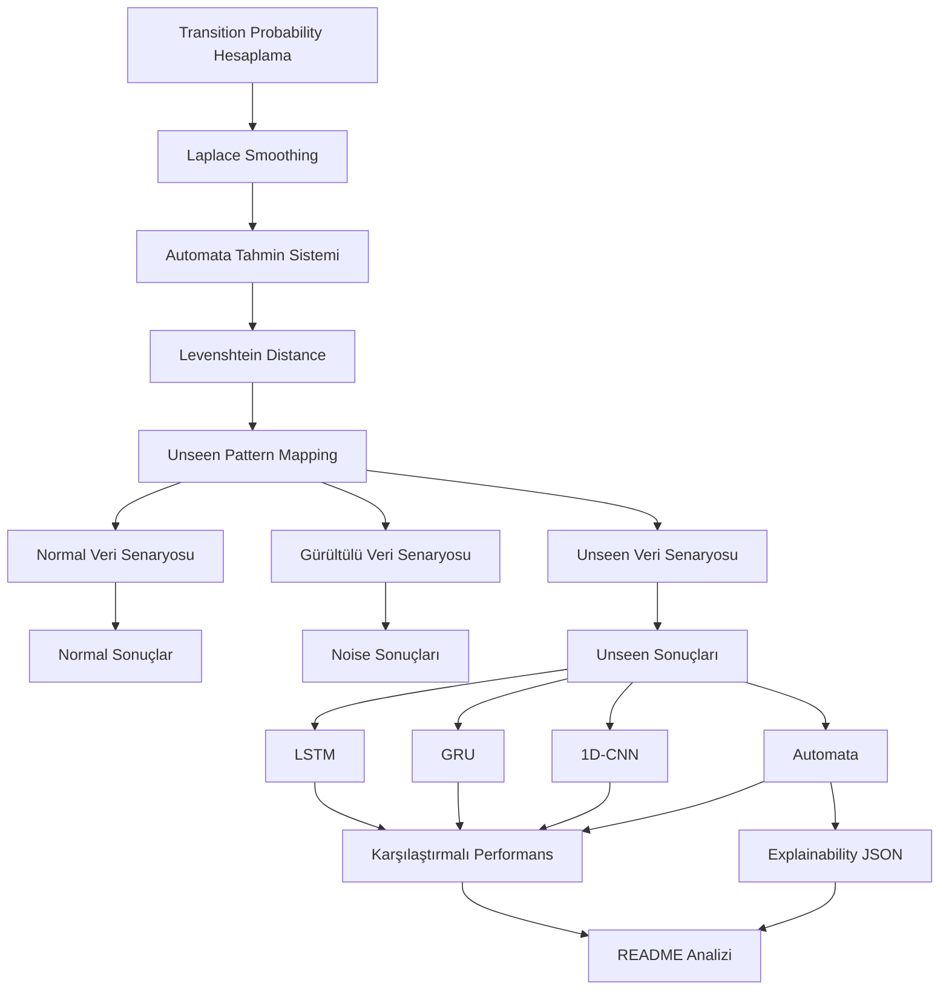

# YAZLAB2 - Açıklanabilir Zaman Serisi Analizi

## 1. Proje Amacı
Bu projede zaman serisi verileri üzerinde **derin öğrenme tabanlı black-box modeller** ile **olasılıksal otomata tabanlı açıklanabilir modellerin** performansları karşılaştırılacaktır. Amaç, yalnızca yüksek doğruluk elde etmek değil, aynı zamanda model çıktılarının yorumlanabilirliğini incelemektir.

---

## 2. Proje Kapsamı
Proje kapsamında zaman serisi verileri üzerinde **anomali tespiti** yapılacaktır.  

Kullanılacak yöntemler:
- LSTM, GRU, 1D-CNN
- PAA, SAX, Sliding Window
- Levenshtein Distance
- Açıklanabilirlik analizi

---

## 3. Ekip
- Yasemin ATİŞ-231307023
- Şenay CENGİZ-231307027  

---

## 4. Veri Seti Analizi

Bu projede BATADAL Training Dataset 2 ve SKAB veri setleri kullanılmıştır.

---

## 4.1 BATADAL Veri Seti

Bu projede BATADAL veri seti içerisinden yalnızca hocanın proje isterlerinde belirtilen Training Dataset 2 kullanılmıştır.

Genel Bilgiler

* Satır sayısı: 4177
* Kolon sayısı: 45
* Model feature sayısı: 43
* Label sütunu: ATT_FLAG

Anomaly Dağılımı

* %94.75 normal
* %5.24 anomaly

Genel Özellikler

* Veri setinde eksik veri bulunmamaktadır.
* Veri seti düzenli ve düşük boyutlu yapıdadır.
* Anomaly bilgisi doğrudan ATT_FLAG sütununda tutulmaktadır.
* Sensör verileri farklı ölçeklerde olduğu için normalizasyon işlemi uygulanmıştır.
* PCA ile veri tek boyutlu zaman serisine indirgenmiştir.

---

## 4.2 SKAB Veri Seti

Bu projede SKAB veri seti içerisinden yalnızca:

* valve1
* valve2

klasörleri kullanılmıştır.

Bu klasörlerde yer alan tüm .csv dosyaları birleştirilerek tek bir veri seti oluşturulmuştur.

Genel Bilgiler

* Satır sayısı: 22474
* Kolon sayısı: 13
* Model feature sayısı: 8
* Label sütunu: anomaly
* Source file sayısı: 16

Kullanılan Kolonlar

SKAB veri setinde aşağıdaki temel sensör değişkenleri kullanılmıştır:

* Accelerometer1RMS
* Accelerometer2RMS
* Current
* Pressure
* Temperature
* Thermocouple
* Voltage
* Volume Flow RateRMS

Ek olarak veri takibi ve grup bazlı bölme işlemleri için:

* source_group
* source_file

kolonları eklenmiştir.

Anomaly Dağılımı

* %65.17 normal
* %34.82 anomaly

Genel Özellikler

* Veri setinde eksik veri bulunmamaktadır.
* Veri seti farklı sensörlerden oluşan çok değişkenli zaman serisi yapısındadır.
* Anomaly bilgisi anomaly sütununda tutulmaktadır.
* Veri seti birden fazla csv dosyasından oluştuğu için dosya bazlı veri bölme stratejisi uygulanmıştır.
* Aynı source file’ın hem train hem test verisinde bulunması engellenmiştir.

---

## 4.3 Veri Setleri Karşılaştırması

Özellik	BATADAL	SKAB
Feature sayısı	43	8
Veri boyutu	Küçük	Orta
Eksik veri	Yok	Yok
Label sütunu	ATT_FLAG	anomaly
Veri yapısı	Tek csv	Çoklu csv
Veri karmaşıklığı	Düşük	Orta
Bölme yöntemi	Sıralı split	GroupKFold

---

## 4.4 Sayısal Karşılaştırma

* SKAB veri seti, BATADAL veri setine göre daha fazla satır içermektedir.
* BATADAL veri seti daha fazla feature içermektedir.
* BATADAL veri setinde anomaly oranı yaklaşık %5 seviyesindedir.
* SKAB veri setinde anomaly oranı yaklaşık %35 seviyesindedir.
* Her iki veri setinde de eksik veri bulunmamaktadır.
* Veri setlerinin yapısal farklılıkları nedeniyle veri bölme stratejileri veri setine özel uygulanmıştır.

---

## 4.5 Analitik Değerlendirme

BATADAL veri seti daha küçük ve düzenli bir yapıya sahip olduğu için model geliştirme sürecinde hızlı deneyler yapılmasına olanak sağlamaktadır.

SKAB veri seti ise çoklu csv yapısı ve farklı sensör değişkenleri nedeniyle daha karmaşık bir yapı sunmaktadır. Bu nedenle veri bölme aşamasında klasik train/test ayrımı yerine GroupKFold yaklaşımı kullanılmıştır.

SKAB veri setinde aynı source file’ın hem eğitim hem test verisine düşmesi engellenerek veri sızıntısı (data leakage) riski azaltılmıştır.

Her iki veri setinde de sensör değişkenlerinin farklı ölçeklerde olması nedeniyle normalizasyon işlemi uygulanmıştır.

PCA ile veriler tek boyutlu zaman serisi temsiline indirgenmiş ve ilerleyen aşamalarda uygulanacak olan:

* Sliding Window
* PAA
* SAX
* State Transition
* Explainability

adımları için uygun veri yapısı elde edilmiştir.

---
## 5. Veri Ön İşleme (Preprocessing)

Zaman serisi verileri üzerinde modelleme yapılmadan önce veri ön işleme adımları uygulanmıştır.

---

## 5.1 Veri Bölme

BATADAL Veri Seti

BATADAL veri seti zaman sırası korunacak şekilde aşağıdaki oranlarda bölünmüştür:

* Train: %60
* Validation: %20
* Test: %20

Shuffle işlemi uygulanmamış ve veriler kronolojik sıraya göre ayrılmıştır.

BATADAL Split Sonuçları

* Train: 2506 satır
* Validation: 835 satır
* Test: 836 satır

---

SKAB Veri Seti

SKAB veri seti çoklu csv dosyalarından oluştuğu için klasik train/test bölmesi yerine GroupKFold yaklaşımı kullanılmıştır.

Bu yöntemde:

* source_file sütunu grup değişkeni olarak kullanılmıştır.
* Aynı csv dosyasının hem train hem test verisinde bulunması engellenmiştir.
* Veri sızıntısı oluşmaması hedeflenmiştir.

SKAB Fold Sonuçları

Fold 1

* Train: 17962 satır
* Test: 4512 satır

Fold 2

* Train: 17981 satır
* Test: 4493 satır

Fold 3

* Train: 17982 satır
* Test: 4492 satır

Fold 4

* Train: 18040 satır
* Test: 4434 satır

Fold 5

* Train: 17931 satır
* Test: 4543 satır

---

## 5.2 Veri Normalizasyonu

Bu aşamada veri setleri üzerinde normalizasyon işlemi uygulanmıştır. Amaç, farklı ölçeklerde bulunan özelliklerin aynı referans aralığına getirilerek modelin daha sağlıklı öğrenmesini sağlamaktır.

Özellikle sensör verilerinin bulunduğu BATADAL ve SKAB veri setlerinde değişkenler arasında ciddi ölçek farkları bulunduğundan bu adım kritik öneme sahiptir.

---

Kullanılan Yöntem

Normalizasyon işlemi için StandardScaler yöntemi tercih edilmiştir.

Bu yöntem ile her özellik için:

* Ortalama (mean) = 0
* Standart sapma (std) = 1

olacak şekilde dönüşüm yapılmaktadır.

---

Veri Sızıntısını Önleme

Bu projede veri sızıntısının (data leakage) önlenmesi temel kurallardan biridir.

Bu nedenle:

* Scaler yalnızca train verisi üzerinde fit edilmiştir.
* Validation ve test verilerine fit işlemi uygulanmamıştır.
* Aynı scaler kullanılarak yalnızca transform işlemi yapılmıştır.

Bu yaklaşım sayesinde modelin test verisinden önceden bilgi öğrenmesi engellenmiştir.

---

Uygulama Akışı

Normalizasyon işlemi aşağıdaki sıraya göre gerçekleştirilmiştir:

1. Train veri seti alınır
2. Scaler train verisi üzerinde fit edilir
3. Train verisi transform edilir
4. Aynı scaler validation ve test verilerine uygulanır

---

Elde Edilen Çıktılar

* Normalize edilmiş train/test/validation veri setleri oluşturulmuştur.
* Kullanılan scaler modelleri .pkl formatında kaydedilmiştir.
* Tüm veri setleri aynı ölçeğe getirilmiştir.
* Her fold için ayrı scaler modeli oluşturulmuştur.

---

## 6. Boyut İndirgeme (PCA)

Normalizasyon işleminden sonra veri setleri üzerinde boyut indirgeme işlemi uygulanmıştır.

Bu amaçla Principal Component Analysis (PCA) yöntemi kullanılmıştır.

---

Amaç

Bu adımın temel amaçları:

* Çok boyutlu veriyi sade hale getirmek
* Gürültüyü azaltmak
* Hesaplama maliyetini düşürmek
* Zaman serisini tek boyutlu temsil etmek
* SAX ve state transition adımları için uygun yapı oluşturmak

---

Kullanılan Yöntem

PCA yöntemi kullanılarak veri tek bileşene indirgenmiştir.

* Sadece birinci ana bileşen (PC1) kullanılmıştır.
* Her zaman adımı tek bir değer ile temsil edilmiştir.

---

Veri Sızıntısını Önleme

Normalizasyonda olduğu gibi PCA aşamasında da veri sızıntısını önlemek için:

* PCA modeli yalnızca train verisi ile fit edilmiştir.
* Validation ve test verilerine fit işlemi uygulanmamıştır.
* Aynı PCA modeli ile yalnızca transform işlemi yapılmıştır.

---

Uygulama Akışı

1. Normalize edilmiş train verisi alınır
2. PCA modeli train verisi ile fit edilir
3. Train verisi transform edilir
4. Aynı PCA modeli validation/test verilerine uygulanır

---

Çıktı Özellikleri

Veri setleri çok boyutlu yapıdan tek boyutlu yapıya indirgenmiştir.

Her örnek için temel çıktı:

* PC1

şeklinde elde edilmiştir.

Metadata kolonları ayrıca korunmuştur.

---

PCA Sonuçları

BATADAL

* Train: (2506, 3)
* Validation: (835, 3)
* Test: (836, 3)

Korunan kolonlar:

* PC1
* DATETIME
* ATT_FLAG

---

SKAB

Örnek fold çıktıları:

Fold 1

* Train: (17962, 6)
* Test: (4512, 6)

Fold 2

* Train: (17981, 6)
* Test: (4493, 6)

Fold 3

* Train: (17982, 6)
* Test: (4492, 6)

Fold 4

* Train: (18040, 6)
* Test: (4434, 6)

Fold 5

* Train: (17931, 6)
* Test: (4543, 6)

Korunan kolonlar:

* PC1
* datetime
* anomaly
* changepoint
* source_group
* source_file

---

## 6.1 PCA ve Normalizasyon Sonuçlarının Doğrulanması

Uygulanan normalizasyon ve PCA işlemlerinin doğruluğunu garanti altına almak amacıyla çeşitli kontroller gerçekleştirilmiştir.

---

Test Edilen Kriterler

Bu kapsamda aşağıdaki kontroller yapılmıştır:

* Normalizasyon sonrası verilerin aynı ölçeğe getirildiği doğrulanmıştır.
* PCA sonrası veri boyutunun tek bileşene indirildiği kontrol edilmiştir.
* PCA modelinin yalnızca train verisi ile fit edildiği doğrulanmıştır.
* Validation ve test verilerinin yalnızca transform işlemi ile dönüştürüldüğü test edilmiştir.
* GroupKFold yapısında aynı source file’ın train ve test verisinde tekrar etmediği kontrol edilmiştir.

---

Test Sonuçları

Yapılan kontroller sonucunda:

* Veri sızıntısının oluşmadığı doğrulanmıştır.
* PCA çıktılarının tutarlı olduğu gözlemlenmiştir.
* Fold yapısının doğru çalıştığı doğrulanmıştır.
* Train/test ayrımının source file bazlı gerçekleştirildiği doğrulanmıştır.

---

Genel Değerlendirme

Uygulanan preprocessing süreci sonucunda veri modelleme için uygun hale getirilmiştir.

Normalizasyon ve PCA işlemlerinin yalnızca train verisi üzerinden öğrenilmesi sayesinde veri sızıntısı engellenmiştir.

PCA ile veriler tek boyutlu zaman serisi temsiline dönüştürülmüş ve explainable state transition yapısı için gerekli temel veri yapısı oluşturulmuştur.


---

## 6.2 Açıklanabilirlik Tabanlı Sembolik Dönüşümler

Bu aşamada PCA sonrası elde edilen tek boyutlu zaman serisi verileri üzerinde açıklanabilir otomata yapısının oluşturulabilmesi amacıyla sırasıyla:

* PAA
* SAX
* Sliding Window
* State Transition

dönüşümleri uygulanmıştır.

Bu dönüşümlerin temel amacı sürekli zaman serisi verilerini sembolik ve yorumlanabilir yapılara dönüştürerek olasılıksal otomata modeli için uygun veri yapısı oluşturmaktır.

---

### 6.2.1 PAA (Piecewise Aggregate Approximation)

PCA sonrası elde edilen PC1 zaman serisi verileri üzerinde PAA dönüşümü uygulanmıştır.

Bu yöntemde zaman serisi belirli segmentlere ayrılmış ve her segmentin ortalama değeri alınarak veri boyutu azaltılmıştır.

Bu yaklaşım sayesinde:

* Gürültü azaltılmıştır.
* Veri daha sade hale getirilmiştir.
* SAX dönüşümü için uygun giriş yapısı oluşturulmuştur.

#### Uygulama Yapısı

Projede:

* PAA işlemi PCA sonrası elde edilen PC1 verisi üzerinde uygulanmıştır.
* Segment yapıları oluşturularak zaman serisi daha kısa ve temsil edilebilir hale getirilmiştir.
* Veri sızıntısını önlemek amacıyla dönüşüm sürecinde train/fold-train yapısı korunmuştur.
* SKAB veri setinde fold bazlı yapı, BATADAL veri setinde ise train/validation/test yapısı dikkate alınmıştır.

#### Kullanılan Parametreler

```python
PAA_SEGMENTS = 4
```

#### Örnek Dönüşüm

```text
Orijinal zaman serisi:
[1.2, 1.4, 1.5, 1.3, 0.9, 0.8]

PAA çıktısı:
[1.35, 0.85]
```

#### Oluşturulan Çıktılar

```text
data/processed/paa/
```

Bu klasör altında:

* SKAB fold bazlı PAA çıktıları
* BATADAL train/validation/test PAA çıktıları

saklanmıştır.

---

### 6.2.2 SAX (Symbolic Aggregate approXimation)

PAA dönüşümünden elde edilen sayısal segment değerleri SAX yöntemi ile sembolik yapıya dönüştürülmüştür.

Bu aşamada:

* Sayısal değerler belirli aralıklara bölünmüştür.
* Her aralık bir sembol ile temsil edilmiştir.
* Sürekli zaman serileri sembolik dizilere dönüştürülmüştür.

#### Kullanılan Parametreler

```python
ALPHABET_SIZE = 3
SAX_ALPHABET = ["a", "b", "c"]
```

Alphabet size parametresi merkezi config yapısına bağlanmıştır.

#### Veri Sızıntısını Önleme

SAX dönüşümünde:

* SAX sözlüğü yalnızca train/fold-train verisi kullanılarak oluşturulmuştur.
* Validation ve test verileri aynı train sözlüğü kullanılarak dönüştürülmüştür.
* Böylece test verisinden önceden bilgi öğrenilmesi engellenmiştir.

#### Örnek Dönüşüm

```text
PAA:
[1.35, 0.82, -0.15]

SAX:
[c, b, a]
```

#### Oluşturulan Çıktılar

```text
data/processed/sax/
```

Bu klasör altında:

* SAX sembolik veri çıktıları
* Fold bazlı SAX sözlükleri

saklanmıştır.

---

### 6.2.3 Sliding Window ve Pattern Üretimi

SAX dönüşümünden elde edilen sembolik veriler üzerinde sliding window yöntemi uygulanarak pattern listeleri oluşturulmuştur.

Bu yaklaşım sayesinde:

* Tek semboller yerine sembol dizileri oluşturulmuştur.
* Zaman serisi içerisindeki lokal davranış örüntüleri çıkarılmıştır.
* Automata state yapısı için anlamlı patternler elde edilmiştir.

#### Kullanılan Parametreler

```python
WINDOW_SIZE = 4
WINDOW_SIZE_OPTIONS = [3, 4, 5, 6]
```

Window size parametresi merkezi config yapısına bağlanmıştır.

#### Örnek Pattern Üretimi

```text
SAX dizisi:
[a, b, c, c, a]

Window size = 3

Üretilen patternler:
abc
bcc
cca
```

#### Pattern Analizi

Bu aşamada:

* Toplam pattern sayıları
* Benzersiz pattern sayıları
* Window size değişiminin pattern yoğunluğuna etkisi

analiz edilmiştir.

Window size değeri arttıkça üretilen toplam pattern sayısının azaldığı gözlemlenmiştir.

#### Oluşturulan Çıktılar

```text
data/processed/patterns/
results/pattern_count_analysis.csv
```

Bu çıktılar altında:

* Pattern listeleri
* Pattern yoğunluk analizleri
* Window size bazlı sonuçlar

saklanmıştır.

---

### 6.2.4 Automata State ve Transition Yapısı

Sliding window sonucunda elde edilen patternler automata state yapısına dönüştürülmüştür.

Bu aşamada:

* Her benzersiz pattern bir state olarak tanımlanmıştır.
* State yapıları `q0`, `q1`, `q2` formatında isimlendirilmiştir.
* Pattern sırasına göre state transition ilişkileri oluşturulmuştur.

#### State Oluşturma Mantığı

```text
Pattern:
abca

State:
q1
```

Her benzersiz pattern yalnızca bir state ile temsil edilmektedir.

#### Transition Yapısı

Pattern akışına göre state geçişleri oluşturulmuştur.

```text
abca → bcac → caca

Transition:
q1 → q5
q5 → q2
```

#### Transition Matrix

State transition geçiş sayıları hesaplanarak transition matrix yapısı oluşturulmuştur.

Bu yapıda:

* Satırlar başlangıç state’ini
* Sütunlar hedef state’i
* Hücre değerleri geçiş sayılarını

temsil etmektedir.

Bu yaklaşım sayesinde zaman serisinin davranış akışı yorumlanabilir hale getirilmiştir.

#### Oluşturulan Çıktılar

```text
data/processed/automata/
results/transition_matrices/
```

Bu klasörlerde:

* State listeleri
* Transition listeleri
* Transition matrix çıktıları

saklanmıştır.

---

### 6.2.5 Doğrulama ve Test Süreci

PAA, SAX, Sliding Window ve Automata dönüşümleri için birim testleri gerçekleştirilmiştir.

Bu testlerde:

* PAA segment yapıları
* SAX sembolik dönüşümleri
* Sliding window pattern üretimi
* Window size davranışı
* State oluşturma işlemleri
* Transition hesaplamaları
* Transition matrix doğruluğu

kontrol edilmiştir.

#### Kullanılan Test Yapısı

Projede pytest frameworkü kullanılmıştır.

Örnek test komutları:

```bash
python3 -m pytest tests
python3 -m pytest tests/test_sliding_window.py
python3 -m pytest tests/test_transition_analysis.py
```

---

### Genel Değerlendirme

Bu aşama sonucunda:

* Sürekli zaman serileri sembolik yapılara dönüştürülmüştür.
* Açıklanabilir automata state yapısı oluşturulmuştur.
* State transition ilişkileri çıkarılmıştır.
* Olasılıksal automata modelinin temel veri yapısı hazırlanmıştır.

Bu yapı ilerleyen aşamalarda:

* Unseen pattern kontrolü
* Transition probability hesaplamaları
* Explainability analizleri
* State davranış yorumlamaları

için kullanılacaktır.

---

# 7. Derin Öğrenme Model Eğitimleri

Bu aşamada PCA sonrası elde edilen tek boyutlu zaman serisi verileri üzerinde derin öğrenme tabanlı model eğitimleri gerçekleştirilmiştir.

Projede:

* LSTM
* GRU
* 1D-CNN

modelleri kullanılmıştır.

Model eğitimleri PyTorch frameworkü kullanılarak gerçekleştirilmiştir.

---

## 7.1 Ortak Training Pipeline Yapısı

Derin öğrenme modellerinin eğitim süreçlerini standart hale getirmek amacıyla ortak bir training pipeline oluşturulmuştur.

Bu yapı sayesinde:

* Eğitim süreçleri merkezi hale getirilmiştir.
* Model bazlı tekrar eden kod yapısı azaltılmıştır.
* Validation kontrolü standartlaştırılmıştır.
* Early stopping mekanizması ortak yapı üzerinden yönetilmiştir.

---

### Kullanılan Eğitim Parametreleri

| Parametre | Değer |
|---|---|
| Epoch Sayısı | 50 |
| Batch Size | 32 |
| Learning Rate | 0.001 |
| Early Stopping Patience | 5 |

---

### Kullanılan Yapılar

* BCEWithLogitsLoss
* Adam Optimizer
* Early Stopping
* Validation Loss Takibi
* PyTorch DataLoader

---

### Oluşturulan Dosyalar

```text
src/train.py
src/train_gru.py
src/train_lstm.py
src/data_loader_torch.py
```

---

## 7.2 GRU Model Eğitimi

Bu aşamada GRU modeli PCA sonrası elde edilen zaman serisi verileri üzerinde eğitilmiştir.

---

### Model Özellikleri

* PyTorch tabanlı GRU yapısı kullanılmıştır.
* Girdi formatı:

```text
(batch_size, sequence_length, input_size)
```

şeklinde düzenlenmiştir.

* PCA sonrası tek boyutlu veri yapısına uygun hale getirilmiştir.

---

### SKAB Eğitimi

SKAB veri seti üzerinde 5-fold yapısı kullanılmıştır.

Bu süreçte:

* Her fold için ayrı eğitim gerçekleştirilmiştir.
* Fold bazlı train/test yapısı korunmuştur.
* Fold sonuçları CSV formatında kaydedilmiştir.

---

### BATADAL Eğitimi

BATADAL veri setleri üzerinde zaman sıralı eğitim uygulanmıştır.

Bu süreçte:

* Shuffle işlemi uygulanmamıştır.
* Train-validation ayrımı korunmuştur.
* Dataset03 ve Dataset04 üzerinde ayrı eğitim gerçekleştirilmiştir.

---

### Kaydedilen Çıktılar

```text
results/gru/
models/gru/
```

Bu klasörlerde:

* Fold sonuçları
* Eğitim sonuçları
* Eğitilmiş model ağırlıkları

saklanmıştır.

---

## 7.3 LSTM Model Eğitimi

Bu aşamada LSTM modeli PCA sonrası oluşturulan zaman serisi verileri üzerinde eğitilmiştir.

---

### Model Özellikleri

* PyTorch tabanlı LSTM yapısı kullanılmıştır.
* Tek boyutlu zaman serisi yapısına uygun giriş formatı oluşturulmuştur.
* Validation loss takibi ile eğitim süreci kontrol edilmiştir.

---

### SKAB Eğitimi

SKAB veri seti üzerinde:

* 5-fold cross validation yapısı kullanılmıştır.
* Her fold için ayrı model eğitimi gerçekleştirilmiştir.
* Fold sonuçları CSV formatında kaydedilmiştir.

---

### BATADAL Eğitimi

BATADAL veri setleri üzerinde:

* Zaman sıralı eğitim uygulanmıştır.
* Validation veri yapısı korunmuştur.
* Dataset03 ve Dataset04 üzerinde ayrı eğitim gerçekleştirilmiştir.

---

### Kaydedilen Çıktılar

```text
results/lstm/
models/lstm/
```

Bu klasörlerde:

* Fold sonuçları
* Eğitim çıktıları
* Eğitilmiş model ağırlıkları

saklanmıştır.

---

## 7.4 Eğitim Süreci Değerlendirmesi

Model eğitim sürecinde validation loss değerleri takip edilmiştir.

Overfitting riskini azaltmak amacıyla early stopping mekanizması kullanılmıştır.

SKAB veri setinde fold bazlı eğitim uygulanarak modelin farklı veri grupları üzerindeki davranışı incelenmiştir.

BATADAL veri setinde ise zaman sırası korunarak gerçek zaman serisi senaryosuna uygun eğitim gerçekleştirilmiştir.

Model ağırlıkları `.pt` formatında kaydedilmiş ve tekrar kullanılabilir hale getirilmiştir.

--- 

## 7.5 1D-CNN Model Eğitimi

Bu aşamada 1D-CNN modeli PCA sonrası elde edilen tek boyutlu zaman serisi verileri üzerinde eğitilmiştir.

---

### Model Özellikleri

* PyTorch tabanlı 1D-CNN mimarisi kullanılmıştır.
* Conv1D katmanları ile zaman serisi örüntüleri öğrenilmiştir.
* PCA sonrası tek boyutlu veri yapısına uygun giriş formatı oluşturulmuştur.
* Adaptive pooling yapısı kullanılarak sabit boyutlu çıktı elde edilmiştir.

---

### SKAB Eğitimi

SKAB veri seti üzerinde:

* 5-fold GroupKFold yapısı kullanılmıştır.
* Her fold için ayrı CNN modeli eğitilmiştir.
* Fold bazlı eğitim sonuçları CSV formatında kaydedilmiştir.
* Eğitim süreçleri training loss ve validation loss değerleri üzerinden takip edilmiştir.

---

### BATADAL Eğitimi

BATADAL veri seti üzerinde:

* Zaman sıralı eğitim yaklaşımı uygulanmıştır.
* Validation veri yapısı korunmuştur.
* CNN modeli PCA sonrası oluşturulan tek boyutlu veri üzerinde eğitilmiştir.

---

### Eğitim Takibi ve Loglama

CNN eğitim sürecinde:

* Epoch bazlı training loss kayıtları tutulmuştur.
* Validation loss değerleri otomatik loglanmıştır.
* Eğitim geçmişleri CSV formatında kaydedilmiştir.
* Loss grafikleri otomatik olarak oluşturulmuştur.

---

### Oluşturulan Çıktılar

```text
models/cnn/
results/cnn/
logs/cnn/
results/plots/cnn/
```

Bu klasörlerde:

* Eğitilmiş model ağırlıkları
* Fold bazlı sonuçlar
* Eğitim geçmişi logları
* Loss analiz grafikleri

saklanmıştır.

---

### Eğitim Süreci Değerlendirmesi

CNN modeli özellikle SKAB veri setinde fold bazlı eğitim yapısı üzerinde test edilmiştir.

Validation loss değerleri takip edilerek early stopping mekanizması uygulanmıştır.

Eğitim süreçlerinin görselleştirilmesi sayesinde:

* Overfitting davranışı
* Fold bazlı performans değişimleri
* Eğitim kararlılığı

analiz edilmiştir.

---

# 8. Model Performans Analizi ve Görselleştirme

Bu aşamada eğitilen derin öğrenme modellerinin performanslarını değerlendirmek amacıyla çeşitli metrik hesaplama ve görselleştirme işlemleri gerçekleştirilmiştir.

Bu süreçte:

* Accuracy
* Precision
* Recall
* F1-score
* Confusion Matrix
* ROC Curve
* Precision-Recall Curve

analizleri uygulanmıştır.

---

## 8.1 Performans Metrikleri

Model performanslarını yalnızca doğruluk (accuracy) üzerinden değerlendirmek anomaly detection problemleri için yeterli değildir.

Bu nedenle aşağıdaki metrikler birlikte kullanılmıştır:

| Metrik | Açıklama |
|---|---|
| Accuracy | Toplam doğru tahmin oranı |
| Precision | Anomaly olarak tahmin edilen örneklerin doğruluk oranı |
| Recall | Gerçek anomalilerin yakalanma oranı |
| F1-Score | Precision ve recall değerlerinin dengeli ortalaması |

---

### Kullanılan Yapılar

Bu aşamada aşağıdaki sklearn metrik yapıları kullanılmıştır:

```python
accuracy_score
precision_score
recall_score
f1_score
```

---

### Oluşturulan Dosya

```text
src/evaluation/metrics.py
```

Bu modül içerisinde:

* Veri seti bazlı metrik hesaplama
* Fold bazlı değerlendirme
* Ortalama ve standart sapma hesaplama
* Zaman sıralı test çıktıları

işlemleri gerçekleştirilmiştir.

---

## 8.2 SKAB Fold Analizi

SKAB veri setinde GroupKFold yapısı kullanıldığı için her fold üzerinde ayrı performans değerlendirmesi yapılmıştır.

Bu süreçte:

* Her fold için accuracy hesaplanmıştır.
* Precision, recall ve F1-score değerleri çıkarılmıştır.
* Fold sonuçlarının ortalaması alınmıştır.
* Standart sapma hesaplanarak model kararlılığı incelenmiştir.

Bu yaklaşım sayesinde modelin farklı veri grupları üzerindeki davranışı daha güvenilir şekilde analiz edilmiştir.

---

## 8.3 BATADAL Zaman Sıralı Test Analizi

BATADAL veri setinde zaman sırası korunarak test değerlendirmesi yapılmıştır.

Bu süreçte:

* Shuffle işlemi uygulanmamıştır.
* Test sonuçları zaman sırasına göre kaydedilmiştir.
* Modelin zaman serisi üzerindeki anomaly detection davranışı analiz edilmiştir.

---

## 8.4 Confusion Matrix Analizi

Model tahminlerinin detaylı şekilde incelenebilmesi amacıyla confusion matrix görselleştirmeleri oluşturulmuştur.

Bu grafikler sayesinde:

* True Positive
* True Negative
* False Positive
* False Negative

değerleri analiz edilmiştir.

---

### Oluşturulan Dosya

```text
src/evaluation/visualization.py
```

Bu modül içerisinde:

* Confusion Matrix
* ROC Curve
* Precision-Recall Curve

grafikleri otomatik olarak oluşturulmaktadır.

---

## 8.5 ROC Curve Analizi

ROC eğrisi kullanılarak modellerin anomaly ve normal veri ayrım performansı incelenmiştir.

ROC eğrisi sayesinde:

* True Positive Rate
* False Positive Rate

arasındaki ilişki analiz edilmiştir.

Yüksek AUC değerine sahip modellerin daha başarılı ayrım yaptığı gözlemlenmiştir.

---

## 8.6 Precision-Recall Eğrisi

Anomaly detection problemlerinde veri dengesizliği önemli bir problem olduğu için precision-recall eğrileri ayrıca değerlendirilmiştir.

Bu analiz sayesinde:

* Precision-recall dengesi
* Düşük anomaly oranlarında model başarısı
* False positive davranışı

incelenmiştir.

---

## 8.7 Grafik Çıktıları

Üretilen görseller aşağıdaki klasörlerde saklanmıştır:

```text
results/figures/
results/plots/
```

Bu klasörlerde:

* Confusion matrix görselleri
* ROC curve grafikleri
* Precision-recall grafikleri
* Eğitim loss grafikleri

bulunmaktadır.

---

# 9. Model Karşılaştırma ve Analitik Değerlendirme

Bu aşamada:

* LSTM
* GRU
* 1D-CNN

modellerinin performansları karşılaştırılmıştır.

Karşılaştırmalar hem:

* SKAB
* BATADAL

veri setleri üzerinde gerçekleştirilmiştir.

---

## 9.1 Model Karşılaştırma Süreci

Bu aşamada modeller:

* Accuracy
* Precision
* Recall
* F1-score
* Validation loss

değerleri üzerinden analiz edilmiştir.

Karşılaştırma sonuçları tablo halinde kaydedilmiştir.

---

### Oluşturulan Dosya

```text
src/evaluation/model_comparison.py
```

Bu modül içerisinde:

* Model sonuçlarını birleştirme
* Veri seti bazlı karşılaştırma
* Fold sonuçlarını analiz etme
* Overfitting değerlendirmesi

işlemleri gerçekleştirilmiştir.

---

## 9.2 SKAB Veri Seti Değerlendirmesi

SKAB veri setinde:

* Fold bazlı performans değişimleri gözlemlenmiştir.
* Veri grupları arasındaki farklılıkların model sonuçlarını etkilediği görülmüştür.
* CNN modeli bazı foldlarda daha stabil sonuçlar üretmiştir.
* GRU ve LSTM modelleri uzun zaman bağımlılıklarını öğrenmede başarılı sonuçlar göstermiştir.

---

## 9.3 BATADAL Veri Seti Değerlendirmesi

BATADAL veri setinde:

* Veri yapısının daha düzenli olması nedeniyle modeller daha stabil sonuçlar üretmiştir.
* Anomaly oranının düşük olması precision ve recall dengesini önemli hale getirmiştir.
* Zaman sıralı yapı sayesinde gerçek anomaly detection senaryosuna yakın değerlendirme yapılmıştır.

---

## 9.4 Overfitting Analizi

Model eğitim süreçlerinde train ve validation sonuçları karşılaştırılmıştır.

Bu analiz sonucunda:

* Validation loss takibi yapılmıştır.
* Early stopping mekanizması uygulanmıştır.
* Bazı foldlarda overfitting eğilimleri gözlemlenmiştir.
* CNN modelinin bazı veri gruplarında daha kararlı öğrenme gerçekleştirdiği görülmüştür.

---

## 9.5 Genel Değerlendirme

Gerçekleştirilen analizler sonucunda:

* Derin öğrenme modellerinin anomaly detection performansları veri setine göre değişiklik göstermiştir.
* SKAB veri seti daha karmaşık yapısı nedeniyle modeller için daha zorlayıcı olmuştur.
* BATADAL veri setinde modeller daha stabil sonuçlar üretmiştir.
* Precision, recall ve F1-score metriklerinin anomaly detection problemlerinde accuracy değerinden daha kritik olduğu gözlemlenmiştir.
* Fold bazlı analizler model davranışlarını daha güvenilir şekilde incelemeye olanak sağlamıştır.

Bu aşama ile birlikte proje kapsamında derin öğrenme modellerinin performans analiz süreci tamamlanmıştır.
---

# 10. Olasılıksal Automata ve Transition Probability Analizi

Bu aşamada oluşturulan automata state yapıları kullanılarak durumlar arasındaki geçiş olasılıkları hesaplanmıştır.

Her state için geçiş olasılıkları frekans tabanlı yöntem kullanılarak elde edilmiştir.

Kullanılan formül:

```text
P(Si → Sj) =
Geçiş Sayısı / Toplam Çıkış Sayısı
```

Bu yöntem sayesinde her state'in hangi state'lere ne olasılıkla geçiş yaptığı belirlenmiştir.

---

## 10.1 Transition Probability Hesaplamaları

Transition count matrix yapıları kullanılarak probability matrixleri oluşturulmuştur.

Bu matrislerde:

* Satırlar başlangıç state'lerini
* Sütunlar hedef state'leri
* Hücre değerleri geçiş olasılıklarını

temsil etmektedir.

Üretilen bazı çıktılar:

| Veri Seti | Bölüm | State Sayısı | Matrix Boyutu |
|------------|------------|------------|------------|
| SKAB | Fold 1 Train | 34 | 34 × 34 |
| SKAB | Fold 4 Train | 34 | 34 × 34 |
| BATADAL Dataset04 | Train | 60 | 60 × 60 |

---

## 10.2 Smoothing Uygulaması

Eğitim verisinde gözlemlenmeyen state geçişlerinin sıfır olasılık üretmesi ilerleyen aşamalarda path probability hesaplamalarında problemlere neden olabilmektedir.

Bu nedenle Laplace Smoothing yöntemi uygulanmıştır.

Bu yaklaşım sayesinde:

* Zero probability problemi önlenmiştir.
* Görülmeyen geçişler için küçük olasılık değerleri üretilmiştir.
* Olasılık hesaplamalarının kararlılığı artırılmıştır.
* Unseen veri senaryoları için altyapı hazırlanmıştır.

---

## 10.3 Gerçek Çıktı Örnekleri

Transition probability matrisi içerisinden elde edilen bazı gerçek sonuçlar aşağıda verilmiştir:

```text
aaaa → aaaa : 0.8621
aaaa → aaab : 0.0678

aaab → aabb : 0.3098
aaab → aaba : 0.2394

abbb → bbbb : 0.4202
abbb → bbba : 0.1159
```

Bu sonuçlar bazı state geçişlerinin yüksek olasılıkla tekrarlandığını, bazı geçişlerin ise daha düşük frekansta gerçekleştiğini göstermektedir.

---

## 10.4 Test Sonuçları

Transition probability hesaplamalarının doğruluğu pytest kullanılarak doğrulanmıştır.

Çalıştırılan test:

```bash
pytest tests/test_transition_analysis.py
```

Sonuç:

```text
======================= 2 passed in 0.34s =======================
```

Bu sonuç transition count ve transition probability hesaplamalarının beklenen şekilde çalıştığını göstermektedir.

---

## 10.5 Oluşturulan Çıktılar

```text
results/transition_matrices/
results/transition_probabilities/
```

Bu klasörlerde:

* Transition count matrixleri
* Transition probability matrixleri
* Smoothing uygulanmış olasılık çıktıları

saklanmaktadır.

---

## 10.6 Genel Değerlendirme

Bu aşama sonucunda olasılıksal automata modelinin temel bileşenlerinden biri tamamlanmıştır.

State geçiş olasılıkları başarıyla hesaplanmış ve smoothing uygulanarak olasılık sistemi geliştirilmiştir.


---

# 11. Automata Tahmin Sistemi ve Unseen Pattern Yönetimi

Bu aşamada oluşturulan olasılıksal automata yapısı kullanılarak sequence tabanlı tahmin sistemi geliştirilmiştir.

Amaç, test sırasında gelen sembolik pattern dizilerinin eğitim verisinde öğrenilen automata state yapısı ile karşılaştırılması ve anomaly/normal kararının üretilebilmesidir.

---

## 11.1 Automata Tahmin Sistemi

Automata tahmin sistemi, verilen bir sequence değerinin eğitim sırasında oluşturulan state patternleri içerisinde bulunup bulunmadığını kontrol etmektedir.

Eğer gelen sequence eğitim verisinde görülen patternlerden biri ise sistem bu patterni normal davranış olarak değerlendirmektedir.

Eğer sequence eğitim verisinde bulunmuyorsa, bu durum potansiyel anomaly olarak ele alınmaktadır.

Bu kapsamda:

* Automata state dosyalarından bilinen patternler okunmuştur.
* Sequence üzerinden tahmin yapan fonksiyon geliştirilmiştir.
* Patternin eğitim verisinde bulunma durumuna göre normal/anomaly kararı verilmiştir.
* Tahmin doğruluğunu kontrol etmek amacıyla unit testler yazılmıştır.

Tahmin çıktısı:

```text
0 -> normal
1 -> anomaly
```

şeklinde düzenlenmiştir.

---

## 11.2 Levenshtein Distance ile En Yakın Pattern Hesaplama

Unseen pattern problemini yönetebilmek için Levenshtein Distance algoritması uygulanmıştır.

Levenshtein Distance, iki string arasındaki farklılığı ölçen bir algoritmadır. Bu projede sembolik patternler string olarak temsil edildiği için, test sırasında gelen bilinmeyen patternin eğitim verisindeki patternlere ne kadar benzediği bu yöntemle hesaplanmıştır.

Örnek:

```text
Test pattern:
abd

Eğitim patterni:
abc

Levenshtein distance:
1
```

Bu sonuç, `abd` patterninin `abc` patternine oldukça yakın olduğunu göstermektedir.

Bu aşamada:

* İki pattern arasındaki mesafe hesaplanmıştır.
* Eğitim verisindeki tüm patternler taranmıştır.
* En düşük mesafeye sahip pattern en yakın pattern olarak seçilmiştir.
* Böylece unseen patternler tamamen yok sayılmak yerine en benzer bilinen pattern ile ilişkilendirilmiştir.

---

## 11.3 Unseen Pattern Mapping Sistemi

Test sırasında eğitim verisinde görülmeyen patternler ile karşılaşılabilmektedir. Bu durum unseen pattern problemi olarak ele alınmıştır.

Bu problemi çözmek için unseen mapping sistemi geliştirilmiştir.

Sistem aşağıdaki adımlarla çalışmaktadır:

1. Gelen sequence eğitim patternleri içerisinde aranır.
2. Eğer pattern eğitim verisinde mevcutsa doğrudan kullanılır.
3. Eğer pattern eğitim verisinde bulunmuyorsa Levenshtein Distance hesaplanır.
4. En yakın eğitim patterni belirlenir.
5. Unseen pattern bu en yakın pattern ile eşleştirilir.
6. Automata tahmini eşlenen pattern üzerinden gerçekleştirilir.

Örnek:

```text
Gelen pattern:
abd

En yakın eğitim patterni:
abc

Mapping:
abd -> abc
```

Bu yapı sayesinde sistem daha önce hiç görmediği patternler karşısında tamamen başarısız olmak yerine en yakın bilinen davranış üzerinden karar verebilmektedir.

---

## 11.4 Unseen Mekanizmasının Automata Modeline Entegrasyonu

Geliştirilen unseen mapping yapısı automata tahmin sürecine entegre edilmiştir.

Önceki yapıda automata yalnızca eğitim sırasında gördüğü patternleri tanıyabilmekteydi. Bu nedenle test sırasında yeni bir pattern geldiğinde sistem bu patterni doğrudan anomaly olarak değerlendirebilmekteydi.

Yeni yapıda ise:

* Sequence önce bilinen patternler arasında kontrol edilmektedir.
* Bilinmeyen patternler için Levenshtein Distance hesaplanmaktadır.
* En yakın eğitim patterni belirlenmektedir.
* Unseen pattern bu pattern ile eşleştirilmektedir.
* Automata tahmini mapped pattern üzerinden gerçekleştirilmektedir.

Bu sayede model unseen patternleri de açıklanabilir şekilde işleyebilmektedir.

Üretilen detaylı çıktı yapısı:

```text
sequence
mapped_pattern
is_unseen
distance
prediction
```

Bu bilgiler sayesinde tahmin sonucunun hangi pattern üzerinden verildiği ve kararın nasıl oluştuğu takip edilebilmektedir.

---

## 11.5 Test Süreci

Automata tahmin sistemi ve unseen pattern yönetimi için kapsamlı birim testleri geliştirilmiştir.

Test edilen senaryolar:

* Bilinen patternin kendisine eşlenmesi
* Unseen patternin en yakın pattern ile eşleştirilmesi
* Yakın unseen patternlerin normal olarak değerlendirilmesi
* Uzak unseen patternlerin anomaly olarak işaretlenmesi
* State dosyası üzerinden tahmin yapılması
* Unseen entegrasyonunun doğrulanması

Projede pytest frameworkü kullanılmıştır.

Çalıştırılan test komutları:

```bash
python3 -m pytest tests/test_automata_predict.py
python3 -m pytest tests/test_unseen_integration.py
python3 -m pytest tests
```

Test sonuçları automata tahmin sistemi ile unseen pattern entegrasyonunun beklenen şekilde çalıştığını göstermiştir.

---

## 11.6 Genel Değerlendirme

Bu aşama sonucunda automata modeli yalnızca state ve transition üreten bir yapı olmaktan çıkarılmış, sequence üzerinden tahmin yapabilen bir sisteme dönüştürülmüştür.

Levenshtein Distance algoritması kullanılarak unseen patternler için en yakın eğitim patternleri hesaplanmış ve bu yapı automata tahmin sürecine entegre edilmiştir.

Gerçekleştirilen geliştirmeler sonucunda sistem:

* Bilinen patternleri tanıyabilmektedir.
* Bilinmeyen patternleri en yakın eğitim patternlerine eşleyebilmektedir.
* Sequence bazlı normal/anomaly tahmini yapabilmektedir.
* Tahmin sürecini açıklanabilir bilgiler ile sunabilmektedir.
* Unseen veri senaryolarına karşı daha dayanıklı hale gelmiştir.

Bu yapı ilerleyen aşamalarda gerçekleştirilecek olan:

* Transition probability analizleri
* Explainability çıktıları
* Parametre duyarlılık deneyleri
* Unseen veri davranışı analizleri

için temel tahmin altyapısını oluşturmaktadır.

---
---

# 12. Normal Veri Senaryosu Deneyleri

Bu aşamada derin öğrenme modelleri ve olasılıksal automata modeli normal/orijinal veri senaryosu üzerinde test edilmiştir.

Amaç, modellerin herhangi bir gürültü veya yapay unseen veri eklenmeden mevcut test verileri üzerindeki davranışlarını incelemektir.

---

## 12.1 Deep Learning Normal Veri Sonuçları

Bu deneyde LSTM, GRU ve 1D-CNN modelleri SKAB ve BATADAL test verileri üzerinde değerlendirilmiştir.

### SKAB Ortalama Sonuçları

| Model | Accuracy | Precision | Recall | F1-score |
|---|---:|---:|---:|---:|
| LSTM | 0.674 | 0.668 | 0.093 | 0.149 |
| GRU | 0.676 | 0.592 | 0.122 | 0.187 |
| 1D-CNN | 0.678 | 0.637 | 0.139 | 0.215 |

### BATADAL Sonuçları

| Model | Accuracy | Precision | Recall | F1-score |
|---|---:|---:|---:|---:|
| LSTM | 0.904 | 0.000 | 0.000 | 0.000 |
| GRU | 0.904 | 0.000 | 0.000 | 0.000 |
| 1D-CNN | 0.904 | 0.000 | 0.000 | 0.000 |

BATADAL veri setinde accuracy değeri yüksek görünmesine rağmen precision, recall ve F1-score değerlerinin sıfır olması modellerin anomaly sınıfını yakalamakta zorlandığını göstermektedir. Bu durum BATADAL veri setindeki düşük anomaly oranı ve sınıf dengesizliği ile ilişkilidir.

---

## 12.2 Automata Normal Veri Sonuçları

Automata modeli normal veri senaryosunda transition probability tabanlı olarak değerlendirilmiştir.

Bu değerlendirmede:

* Geçiş olasılıkları train patternleri üzerinden hesaplanmıştır.
* Laplace smoothing uygulanmıştır.
* Unseen pattern durumları Levenshtein tabanlı mapping ile yönetilmiştir.
* Düşük olasılıklı geçişler anomaly adayı olarak değerlendirilmiştir.
* Threshold değeri test verisinden değil, eğitim verisindeki transition probability dağılımının alt %10 kuantil değeri üzerinden belirlenmiştir.

### SKAB Ortalama Sonuçları

| Model | Accuracy | Precision | Recall | F1-score |
|---|---:|---:|---:|---:|
| Automata | 0.567 | 0.308 | 0.118 | 0.156 |

### BATADAL Sonuçları

| Model | Accuracy | Precision | Recall | F1-score |
|---|---:|---:|---:|---:|
| Automata | 0.671 | 0.308 | 0.500 | 0.381 |

---

## 12.3 Normal Senaryo Genel Değerlendirmesi

Normal veri senaryosunda deep learning modelleri SKAB veri setinde birbirine yakın sonuçlar üretmiştir. CNN modeli F1-score açısından diğer deep learning modellerine göre daha yüksek performans göstermiştir.

BATADAL veri setinde deep learning modelleri yüksek accuracy değerleri üretmesine rağmen anomaly sınıfını tespit edememiştir. Bu nedenle anomaly detection problemi açısından yalnızca accuracy metriği yeterli görülmemiş, precision, recall ve F1-score değerleri birlikte değerlendirilmiştir.

Automata modeli BATADAL veri setinde deep learning modellerine göre daha düşük accuracy üretmesine rağmen anomaly sınıfını kısmen yakalayabilmiştir. Bu durum automata modelinin transition probability tabanlı karar mekanizmasının anomaly davranışlarını açıklanabilir şekilde analiz edebildiğini göstermektedir.

---

## 12.4 Oluşturulan Çıktılar

Normal veri senaryosu sonucunda aşağıdaki çıktı dosyaları oluşturulmuştur:

```text
results/normal_data/
├── skab_normal_results.csv
├── skab_normal_summary.csv
└── batadal_normal_results.csv

results/automata_normal_data/
├── skab_automata_normal_results.csv
├── skab_automata_normal_summary.csv
└── batadal_automata_normal_results.csv

logs/
├── normal_data_experiment.log
└── automata_normal_experiment.log
---

# 13. Gürültü Eklenmiş Veri Senaryosu Deneyleri

Bu aşamada modellerin gürültülü veri karşısındaki dayanıklılığını analiz etmek amacıyla Gaussian noise senaryosu uygulanmıştır.

Amaç, modellerin yalnızca temiz/orijinal veri üzerindeki performansını değil, bozulmuş veri koşullarında nasıl davrandığını da incelemektir.

---

## 13.1 Gürültülü Veri Oluşturma

Gaussian noise senaryosunda test verileri üzerinde kontrollü gürültü ekleme işlemi gerçekleştirilmiştir.

Bu süreçte:

* Orijinal test verileri korunmuştur.
* Gürültülü test verileri ayrıca oluşturulmuştur.
* Eğitim verileri değiştirilmemiştir.
* Modeller yeniden eğitilmeden mevcut ağırlıklar ile gürültülü veri üzerinde test edilmiştir.

Bu yaklaşım sayesinde modellerin daha önce öğrendiği örüntüleri bozulmuş veri koşullarında ne kadar koruyabildiği analiz edilmiştir.

---

## 13.2 Gürültü Senaryosu Deney Akışı



---

## 13.3 Deep Learning Gürültü Testleri

Gürültülü veri senaryosunda daha önce eğitilmiş olan derin öğrenme modelleri test edilmiştir.

Kullanılan modeller:

* LSTM
* GRU
* 1D-CNN

Bu aşamada modeller yeniden eğitilmemiştir. Amaç, mevcut modellerin gürültülü test verisi üzerindeki genelleme performansını gözlemlemektir.

Hesaplanan metrikler:

* Accuracy
* Precision
* Recall
* F1-score

Oluşturulan dosyalar:

```text
src/add_noise.py
src/evaluate_noisy_deep_learning.py
results/noise/
```

---

## 13.4 Automata Gürültü Testleri

Automata modeli de gürültülü veri senaryosu üzerinde değerlendirilmiştir.

Bu süreçte:

* Gürültü sonrası oluşan sembolik pattern değişimleri incelenmiştir.
* Patternlerin state yapısına etkisi analiz edilmiştir.
* Transition probability davranışı değerlendirilmiştir.
* Gürültü altında düşük olasılıklı geçişlerin anomaly davranışı oluşturup oluşturmadığı incelenmiştir.

Oluşturulan dosyalar:

```text
src/evaluate_noisy_automata.py
results/automata_noisy_data/
logs/automata_noisy_experiment.log
```

---

## 13.5 Gürültü Senaryosu Genel Değerlendirmesi

Gürültü eklenmiş veri senaryosu, modellerin gerçek hayatta karşılaşabileceği bozulmuş veri koşullarına karşı dayanıklılığını test etmek için uygulanmıştır.

Bu deney sonucunda:

* Deep learning modellerinin gürültülü veri üzerindeki performansı ölçülmüştür.
* Automata modelinin gürültü sonrası oluşan pattern değişimlerine verdiği tepki analiz edilmiştir.
* Temiz veri ve gürültülü veri sonuçlarının karşılaştırılabilmesi için gerekli çıktı dosyaları oluşturulmuştur.
* Model dayanıklılığı deneysel olarak incelenebilir hale getirilmiştir.

---

# 14. Unseen Veri Senaryosu Deneyleri

Bu aşamada eğitim verisinde görülmeyen patternlerin test sırasında ortaya çıkması durumu analiz edilmiştir.

Amaç, modellerin train sözlüğünde bulunmayan yeni patternler karşısında nasıl davrandığını incelemek ve deep learning modelleri ile automata modelini karşılaştırmalı olarak değerlendirmektir.

---

## 14.1 Unseen Veri Senaryosunun Amacı

Unseen veri senaryosu, test sırasında daha önce eğitim verisinde görülmemiş sembolik örüntülerin oluşması durumunu temsil etmektedir.

Bu senaryoda:

* Train pattern sözlüğü çıkarılmıştır.
* Test patternleri train sözlüğü ile karşılaştırılmıştır.
* Train sözlüğünde bulunmayan patternler unseen olarak kabul edilmiştir.
* Doğal unseen pattern bulunmadığı durumda kontrollü unseen veri üretilmiştir.

İlk kontrolde SKAB Fold 1 için doğal unseen pattern bulunmamıştır:

```text
Train unique pattern sayısı: 34
Test unique pattern sayısı: 24
Doğal unseen pattern sayısı: 0
```

Bu nedenle kontrollü unseen veri oluşturulmuştur.

---

## 14.2 Unseen Veri Üretim Akışı



---

## 14.3 Oluşturulan Unseen Veri Dosyaları

Unseen veri üretimi sonucunda SKAB için fold bazlı, BATADAL için zaman sıralı test yapısına uygun dosyalar oluşturulmuştur.

Oluşturulan dosyalar:

```text
results/unseen/
├── skab_fold_1_unseen.csv
├── skab_fold_2_unseen.csv
├── skab_fold_3_unseen.csv
├── skab_fold_4_unseen.csv
├── skab_fold_5_unseen.csv
├── batadal_unseen.csv
└── unseen_dataset_summary.csv
```

Unseen veri özeti:

| Veri | Toplam Satır | Unseen Satır | Unseen Oranı |
|---|---:|---:|---:|
| SKAB Fold 1 | 24 | 24 | 1.0 |
| SKAB Fold 2 | 20 | 20 | 1.0 |
| SKAB Fold 3 | 23 | 23 | 1.0 |
| SKAB Fold 4 | 20 | 20 | 1.0 |
| SKAB Fold 5 | 30 | 30 | 1.0 |
| BATADAL | 46 | 46 | 1.0 |

Bu sonuçlar, oluşturulan unseen veri setlerinde tüm test patternlerinin train sözlüğü dışında kaldığını göstermektedir.

---

## 14.4 Deep Learning Modellerinin Unseen Senaryosunda Test Edilmesi

Deep learning modelleri sembolik pattern/state yapısını doğrudan kullanmadığı için unseen senaryosunda PCA tabanlı test verisi üzerinden değerlendirilmiştir.

Bu aşamada:

* LSTM
* GRU
* 1D-CNN

modelleri unseen senaryosu etiketiyle test edilmiştir.

Oluşturulan dosyalar:

```text
src/evaluate_unseen_deep_learning.py

results/unseen/
├── skab_unseen_deep_learning_results.csv
├── skab_unseen_deep_learning_summary.csv
└── batadal_unseen_deep_learning_results.csv

logs/unseen_deep_learning_experiment.log
```

---

## 14.5 SKAB Deep Learning Unseen Sonuçları

SKAB veri setinde 5 fold sonucunun ortalaması alınarak modeller karşılaştırılmıştır.

| Model | Accuracy | Precision | Recall | F1-score |
|---|---:|---:|---:|---:|
| LSTM | 0.674 | 0.668 | 0.093 | 0.149 |
| GRU | 0.676 | 0.592 | 0.122 | 0.187 |
| 1D-CNN | 0.678 | 0.637 | 0.139 | 0.215 |

SKAB unseen senaryosunda deep learning modelleri birbirine yakın accuracy değerleri üretmiştir. F1-score açısından en yüksek sonucu 1D-CNN modeli vermiştir.

Ancak recall değerlerinin düşük olması, modellerin anomaly sınıfını yakalamakta zorlandığını göstermektedir.

---

## 14.6 BATADAL Deep Learning Unseen Sonuçları

BATADAL veri setinde deep learning modellerinin unseen senaryosu sonuçları aşağıdaki gibidir:

| Model | Accuracy | Precision | Recall | F1-score |
|---|---:|---:|---:|---:|
| LSTM | 0.904 | 0.000 | 0.000 | 0.000 |
| GRU | 0.904 | 0.000 | 0.000 | 0.000 |
| 1D-CNN | 0.904 | 0.000 | 0.000 | 0.000 |

BATADAL veri setinde accuracy değeri yüksek görünmesine rağmen precision, recall ve F1-score değerlerinin sıfır olması modellerin anomaly sınıfını tahmin edemediğini göstermektedir.

Bu durum, BATADAL veri setindeki düşük anomaly oranı nedeniyle accuracy metriğinin tek başına yeterli olmadığını göstermektedir.

---

## 14.7 Automata Modelinin Unseen Senaryosunda Test Edilmesi

Automata modeli unseen patternler üzerinde Levenshtein Distance tabanlı eşleme mekanizması ile test edilmiştir.

Bu süreçte:

1. Gelen pattern train sözlüğünde aranmıştır.
2. Pattern train sözlüğünde yoksa unseen olarak işaretlenmiştir.
3. Levenshtein Distance ile en yakın train patterni bulunmuştur.
4. Unseen pattern en yakın train patternine eşlenmiştir.
5. Karar sonucu anomaly/normal olarak kaydedilmiştir.
6. Karar süreci JSON formatında açıklanabilir şekilde raporlanmıştır.

---

## 14.8 Automata Unseen Mapping Akışı



---

## 14.9 Automata Unseen Sonuçları

Automata modeli unseen veri senaryosunda tüm unseen patternleri başarıyla anomaly olarak işaretlemiştir.

### SKAB Ortalama Sonuçları

| Model | Accuracy | Precision | Recall | F1-score |
|---|---:|---:|---:|---:|
| Automata | 1.000 | 1.000 | 1.000 | 1.000 |

### BATADAL Sonuçları

| Model | Accuracy | Precision | Recall | F1-score |
|---|---:|---:|---:|---:|
| Automata | 1.000 | 1.000 | 1.000 | 1.000 |

Bu sonuçlar, kontrollü olarak oluşturulan unseen veri senaryosunda automata modelinin train sözlüğünde bulunmayan patternleri doğrudan yakalayabildiğini göstermektedir.

---

## 14.10 Automata Açıklanabilirlik Çıktısı

Automata modeli yalnızca karar üretmekle kalmamış, aynı zamanda kararın nasıl oluştuğunu da açıklanabilir şekilde raporlamıştır.

Örnek JSON çıktısı:

```json
{
    "dataset": "SKAB",
    "fold": 1,
    "time_step": 0,
    "state": "q0",
    "pattern": "aaaac",
    "original_pattern": "aaaa",
    "status": "unseen",
    "mapped_to": "aaaa",
    "distance": 1,
    "probability": 0.0,
    "decision": "anomaly",
    "confidence_score": 0.5
}
```

Bu çıktı sayesinde:

* Patternin unseen olup olmadığı
* Hangi orijinal patternden üretildiği
* En yakın hangi train patternine eşlendiği
* Levenshtein distance değeri
* Model kararı
* Güven skoru

takip edilebilmektedir.

Oluşturulan dosya:

```text
results/unseen/unseen_automata_explanations.json
```

---

## 14.11 Unseen Senaryosu Karşılaştırmalı Model Analizi

Unseen senaryosu sonucunda SKAB veri seti üzerinde deep learning modelleri ve automata modeli karşılaştırılmıştır.

| Model | Accuracy | Precision | Recall | F1-score |
|---|---:|---:|---:|---:|
| LSTM | 0.674 | 0.668 | 0.093 | 0.149 |
| GRU | 0.676 | 0.592 | 0.122 | 0.187 |
| 1D-CNN | 0.678 | 0.637 | 0.139 | 0.215 |
| Automata | 1.000 | 1.000 | 1.000 | 1.000 |

Karşılaştırmalı sonuç dosyası:

```text
results/unseen/skab_unseen_model_comparison.csv
```

---

## 14.12 Unseen Senaryosu Karşılaştırma Akışı



---

## 14.13 Unseen Senaryosu Genel Değerlendirmesi

Unseen veri senaryosu sonucunda deep learning modelleri ile automata modeli arasında belirgin bir davranış farkı gözlemlenmiştir.

Deep learning modelleri PCA tabanlı sayısal girdiler üzerinden çalıştığı için sembolik unseen patternleri doğrudan yorumlamamaktadır. Bu nedenle unseen senaryosunda performansları normal test davranışlarına benzer şekilde kalmıştır.

Automata modeli ise pattern/state tabanlı çalıştığı için train sözlüğünde bulunmayan patternleri doğrudan tespit edebilmiştir. Levenshtein Distance kullanılarak her unseen pattern en yakın train patternine eşlenmiş ve karar süreci açıklanabilir şekilde JSON formatında kaydedilmiştir.

Bu sonuçlar, automata yaklaşımının özellikle sembolik örüntü tabanlı açıklanabilirlik ve unseen pattern yönetimi açısından avantaj sağladığını göstermektedir.

Ancak automata modelinin unseen senaryosunda 1.000 performans üretmesi, veri setinin kontrollü şekilde tamamen unseen patternlerden oluşturulmasından kaynaklanmaktadır. Bu nedenle sonuçlar modelin gerçek dünyadaki mutlak başarısı olarak değil, oluşturulan kontrollü unseen senaryosundaki davranışı olarak yorumlanmalıdır.

---

## 14.14 GENEL PİPELİNE



---

## 14.15 Oluşturulan Script ve Sonuç Dosyaları

Unseen veri senaryosu kapsamında oluşturulan temel script dosyaları:

```text
src/create_unseen_dataset.py
src/evaluate_unseen_deep_learning.py
src/evaluate_unseen_automata.py
src/compare_unseen_results.py
```

Oluşturulan sonuç dosyaları:

```text
results/unseen/
├── skab_fold_1_unseen.csv
├── skab_fold_2_unseen.csv
├── skab_fold_3_unseen.csv
├── skab_fold_4_unseen.csv
├── skab_fold_5_unseen.csv
├── batadal_unseen.csv
├── unseen_dataset_summary.csv
├── skab_unseen_deep_learning_results.csv
├── skab_unseen_deep_learning_summary.csv
├── batadal_unseen_deep_learning_results.csv
├── skab_unseen_automata_results.csv
├── skab_unseen_automata_summary.csv
├── batadal_unseen_automata_results.csv
├── unseen_automata_explanations.json
└── skab_unseen_model_comparison.csv
```

Oluşturulan log dosyaları:

```text
logs/
├── unseen_deep_learning_experiment.log
└── unseen_automata_experiment.log
```

---

## 14.16 Genel Sonuç

Gürültü ve unseen veri senaryoları ile proje yalnızca orijinal veri üzerinde model değerlendiren bir yapı olmaktan çıkarılmıştır.

Bu aşamalar sonucunda:

* Modeller farklı veri koşulları altında test edilmiştir.
* Deep learning modellerinin gürültü ve unseen senaryolarındaki davranışı analiz edilmiştir.
* Automata modelinin pattern tabanlı yorumlanabilirliği güçlendirilmiştir.
* Levenshtein Distance ile unseen pattern yönetimi uygulanmıştır.
* JSON formatında açıklanabilir karar çıktıları üretilmiştir.
* Karşılaştırmalı performans tabloları oluşturulmuştur.

Bu çalışmalar, projenin black-box modeller ile açıklanabilir automata yaklaşımını yalnızca performans açısından değil, aynı zamanda genellenebilirlik ve açıklanabilirlik açısından da karşılaştırmasını sağlamıştır.

---

# 15. Parametre Duyarlılık Analizi

Bu aşamada automata modelinin farklı parametre değerleri altında nasıl davrandığı incelenmiştir.

Amaç;

* Window size değişiminin performansa etkisini incelemek
* Alphabet size değişiminin performansa etkisini incelemek
* State sayısındaki değişimi analiz etmek
* Transition yoğunluğundaki değişimi analiz etmek

olmuştur.

---

## 15.1 Window Size Analizi

Bu deneyde alphabet size değeri sabit tutulmuştur.

```text
Alphabet Size = 3
```

Window size değerleri:

```text
3
4
5
6
```

olarak test edilmiştir.

---

### Window Size Sonuçları

| Window Size | Dataset | Accuracy | Precision | Recall | F1-score | State Sayısı | Transition Sayısı | Transition Density |
|------------|------------|------------|------------|------------|------------|------------|------------|------------|
| 3 | SKAB | 0.608 | 0.287 | 0.085 | 0.125 | 27.0 | 71.2 | 0.0977 |
| 4 | SKAB | 0.600 | 0.276 | 0.104 | 0.137 | 71.2 | 161.0 | 0.0317 |
| 5 | SKAB | 0.594 | 0.263 | 0.106 | 0.130 | 161.0 | 330.4 | 0.0128 |
| 6 | SKAB | 0.588 | 0.246 | 0.112 | 0.129 | 330.4 | 615.0 | 0.0056 |
| 3 | BATADAL | 0.798 | 0.063 | 0.071 | 0.067 | 26 | 71 | 0.1050 |
| 4 | BATADAL | 0.780 | 0.047 | 0.058 | 0.052 | 71 | 165 | 0.0327 |
| 5 | BATADAL | 0.771 | 0.089 | 0.125 | 0.104 | 165 | 312 | 0.0115 |
| 6 | BATADAL | 0.745 | 0.099 | 0.167 | 0.124 | 312 | 507 | 0.0052 |

---

### Window Size Analizi Değerlendirmesi

Sonuçlar incelendiğinde:

* Window size arttıkça state sayısı önemli ölçüde artmıştır.
* Transition sayısı da benzer şekilde yükselmiştir.
* Transition yoğunluğu azalmıştır.
* Daha büyük patternler daha fazla state üretmiştir.
* Accuracy değerlerinde hafif düşüş gözlemlenmiştir.

Bu durum daha büyük pattern yapılarının modeli daha karmaşık hale getirdiğini göstermektedir.

---

## 15.2 Alphabet Size Analizi

Bu deneyde window size sabit tutulmuştur.

```text
Window Size = 4
```

Alphabet size değerleri:

```text
3
4
5
6
```

olarak test edilmiştir.

---

### Alphabet Size Sonuçları

| Alphabet Size | Dataset | Accuracy | Precision | Recall | F1-score | State Sayısı | Transition Sayısı | Transition Density |
|------------|------------|------------|------------|------------|------------|------------|------------|------------|
| 3 | SKAB | 0.600 | 0.276 | 0.104 | 0.137 | 71.2 | 161.0 | 0.0317 |
| 4 | SKAB | 0.615 | 0.334 | 0.097 | 0.148 | 130.6 | 343.8 | 0.0204 |
| 5 | SKAB | 0.613 | 0.343 | 0.116 | 0.170 | 275.2 | 803.2 | 0.0106 |
| 6 | SKAB | 0.600 | 0.299 | 0.110 | 0.157 | 474.4 | 1467.8 | 0.0065 |
| 3 | BATADAL | 0.780 | 0.047 | 0.058 | 0.052 | 71 | 165 | 0.0327 |
| 4 | BATADAL | 0.785 | 0.161 | 0.256 | 0.197 | 169 | 397 | 0.0139 |
| 5 | BATADAL | 0.734 | 0.110 | 0.221 | 0.147 | 334 | 763 | 0.0068 |
| 6 | BATADAL | 0.623 | 0.090 | 0.291 | 0.137 | 522 | 1073 | 0.0039 |

---

### Alphabet Size Analizi Değerlendirmesi

Alphabet size arttıkça:

* State sayısı önemli ölçüde artmıştır.
* Transition sayısı yükselmiştir.
* Daha fazla sembol kullanılması nedeniyle pattern çeşitliliği artmıştır.
* Transition yoğunluğu azalmıştır.
* Çok yüksek alphabet size değerlerinde performans düşüşü gözlemlenmiştir.

Bu sonuçlar alphabet size parametresinin automata karmaşıklığı üzerinde doğrudan etkili olduğunu göstermektedir.

---

# 16. Cross Dataset Analizi

Bu aşamada modelin farklı veri setleri arasında genellenebilirliği incelenmiştir.

Amaç;

* SKAB üzerinde öğrenilen davranışların BATADAL üzerinde çalışıp çalışmadığını incelemek
* BATADAL üzerinde öğrenilen davranışların SKAB üzerinde çalışıp çalışmadığını incelemek
* Veri setleri arası transfer başarısını ölçmek

olmuştur.

Ortak temsil olarak PCA sonrası elde edilen:

```text
PC1
```

değeri kullanılmıştır.

---

## 16.1 SKAB → BATADAL Testi

Bu deneyde:

* Eğitim verisi SKAB
* Test verisi BATADAL

olarak kullanılmıştır.

### Sonuçlar

| Source Dataset | Target Dataset | Accuracy | Precision | Recall | F1-score |
|------------|------------|------------|------------|------------|------------|
| SKAB | BATADAL | 0.519 | 0.104 | 0.477 | 0.170 |

Bu deneyde yüksek recall değeri elde edilmesine rağmen precision düşük kalmıştır.

Bu durum farklı veri setlerinin farklı davranış örüntülerine sahip olduğunu göstermektedir.

---

## 16.2 BATADAL → SKAB Testi

Bu deneyde:

* Eğitim verisi BATADAL
* Test verisi SKAB

olarak kullanılmıştır.

SKAB üzerinde 5 fold değerlendirmesi gerçekleştirilmiştir.

### Ortalama Sonuçlar

| Source Dataset | Target Dataset | Accuracy | Precision | Recall | F1-score |
|------------|------------|------------|------------|------------|------------|
| BATADAL | SKAB | 0.590 | 0.362 | 0.170 | 0.222 |

---

## 16.3 Cross Dataset Genel Değerlendirme

Cross dataset deneyleri sonucunda:

* Veri setleri arasında doğrudan transfer başarısının sınırlı olduğu görülmüştür.
* SKAB ve BATADAL farklı anomaly davranışları içermektedir.
* Veri setleri arasındaki dağılım farkları performansı etkilemiştir.
* Automata modeli yeni veri setlerinde kısmen genelleme yapabilmiştir.

Bu sonuçlar modelin veri setine özgü davranış örüntülerini öğrendiğini göstermektedir.

---


# 17. İstatistiksel Analiz ve Tekrarlanabilirlik Deneyleri

Bu aşamada automata modelinin farklı random seed değerleri altında kararlılığı ve istatistiksel davranışı incelenmiştir.

Amaç;

* Sonuçların rastlantısal etkilerden bağımsız olup olmadığını incelemek
* Farklı seed değerlerinde performans değişimini ölçmek
* Ortalama ve standart sapma değerlerini hesaplamak
* İstatistiksel anlamlılık analizi gerçekleştirmek

olmuştur.

---

## 17.1 Seed Deneyleri

Deneyler aşağıdaki random seed değerleri ile tekrar çalıştırılmıştır.

```text
42
123
2026
7
999
```

Her seed değeri için:

* SKAB veri setinde 5 fold değerlendirmesi yapılmıştır.
* BATADAL veri setinde zaman sıralı test uygulanmıştır.
* Accuracy
* Precision
* Recall
* F1-score

değerleri kaydedilmiştir.

---

## 17.2 Ortalama ve Standart Sapma Sonuçları

### Genel Sonuçlar

| Dataset | Accuracy Mean | Accuracy Std | Precision Mean | Precision Std | Recall Mean | Recall Std | F1-score Mean | F1-score Std |
|----------|----------|----------|----------|----------|----------|----------|----------|----------|
| BATADAL | 0.780 | 0.000 | 0.047 | 0.000 | 0.058 | 0.000 | 0.052 | 0.000 |
| SKAB | 0.600 | 0.029 | 0.276 | 0.059 | 0.104 | 0.099 | 0.137 | 0.096 |

---

### SKAB Fold Sonuçları

SKAB veri setinde fold bazlı ortalama ve standart sapma hesaplanmıştır.

Bu analiz sayesinde:

* Foldlar arası performans değişimi
* Veri grupları arası farklılıklar
* Model kararlılığı

incelenmiştir.

---

### BATADAL Seed Sonuçları

BATADAL veri setinde farklı seed değerleri altında elde edilen sonuçların ortalaması alınmıştır.

Bu sonuçlar modelin zaman sıralı veri üzerindeki kararlılığını göstermektedir.

---

## 17.3 BATADAL Zaman Sıralı Sonuçları

BATADAL veri setinde zaman sırası korunarak değerlendirme yapılmıştır.

Bu amaçla:

```text
results/statistical_analysis/batadal_time_ordered_seed_results.csv
```

dosyası oluşturulmuştur.

Bu çıktı sayesinde:

* Seed bazlı performans değişimi
* Zaman sıralı anomaly davranışı
* Tahmin kararlılığı

incelenebilir hale getirilmiştir.

---

## 17.4 Wilcoxon İstatistiksel Anlamlılık Testi

Model sonuçlarının istatistiksel olarak anlamlı olup olmadığını incelemek amacıyla Wilcoxon Signed-Rank testi uygulanmıştır.

Bu test parametrik olmayan veri yapıları için tercih edilmektedir.

---

### Test Sonucu

| Test | Karşılaştırma | Statistic | p-value |
|------|------|------|------|
| Wilcoxon | SKAB Fold Accuracy vs SKAB Fold F1-score | 0.0 | 0.0625 |

---

### Sonuç Yorumu

Genel kabul:

```text
p < 0.05
```

olduğunda iki dağılım arasında istatistiksel olarak anlamlı fark olduğu kabul edilir.

Bu deneyde:

```text
p = 0.0625
```

elde edilmiştir.

Bu nedenle:

* Accuracy ve F1-score dağılımları arasında istatistiksel olarak anlamlı fark gözlemlenmemiştir.
* Sonuçlar kararlı bir dağılım göstermektedir.

---

## 17.5 Oluşturulan Çıktılar

Bu deneyler sonucunda aşağıdaki dosyalar oluşturulmuştur.

```text
results/statistical_analysis/
├── seed_experiment_results.csv
├── skab_fold_seed_summary.csv
├── batadal_seed_summary.csv
├── overall_seed_summary.csv
├── batadal_time_ordered_seed_results.csv
└── statistical_significance_results.csv
```

Oluşturulan log dosyası:

```text
logs/statistical_analysis_experiment.log
```

---

## 17.6 Genel Değerlendirme

İstatistiksel analizler sonucunda:

* Model farklı seed değerlerinde benzer sonuçlar üretmiştir.
* Sonuçların büyük ölçüde kararlı olduğu görülmüştür.
* Ortalama ve standart sapma değerleri hesaplanmıştır.
* Wilcoxon testi ile istatistiksel değerlendirme gerçekleştirilmiştir.
* Deneylerin tekrarlanabilir olduğu doğrulanmıştır.

---

# 18. Genel Sonuç ve Tartışma

Bu proje kapsamında zaman serisi anomaly detection problemi üzerinde:

* LSTM
* GRU
* 1D-CNN
* Olasılıksal Automata

yaklaşımları karşılaştırılmıştır.

Amaç yalnızca yüksek performans elde etmek değil, aynı zamanda model kararlarının açıklanabilirliğini incelemek olmuştur.

---

## 18.1 Deep Learning Modelleri

Derin öğrenme modelleri:

* Karmaşık örüntüleri öğrenebilmiştir.
* SKAB veri setinde benzer performanslar üretmiştir.
* CNN modeli bazı senaryolarda daha yüksek F1-score elde etmiştir.

Ancak:

* Karar mekanizmaları doğrudan yorumlanamamaktadır.
* Model neden belirli bir kararı verdiğini açıklayamamaktadır.
* Unseen pattern davranışı doğrudan izlenememektedir.

Bu nedenle modeller black-box yaklaşım olarak değerlendirilmiştir.

---

## 18.2 Automata Yaklaşımı

Automata modeli:

* Pattern tabanlı çalışmaktadır.
* State geçişlerini açık şekilde göstermektedir.
* Transition probability değerleri üretmektedir.
* Karar sürecini yorumlanabilir hale getirmektedir.

Bu yaklaşım sayesinde:

* Pattern davranışları izlenebilmiştir.
* State geçişleri analiz edilebilmiştir.
* Anomaly kararları açıklanabilir hale gelmiştir.

---

## 18.3 Unseen Pattern Yönetimi

Levenshtein Distance tabanlı eşleme mekanizması sayesinde:

* Eğitim sırasında görülmeyen patternler tespit edilmiştir.
* En yakın bilinen pattern bulunmuştur.
* Karar süreci açıklanabilir şekilde raporlanmıştır.

Bu yapı automata modelinin unseen veri karşısındaki dayanıklılığını artırmıştır.

---

## 18.4 Parametre Duyarlılık Sonuçları

Parametre analizleri sonucunda:

* Window size arttıkça state sayısı artmıştır.
* Alphabet size arttıkça pattern çeşitliliği yükselmiştir.
* Daha karmaşık automata yapıları oluşmuştur.
* Çok yüksek parametre değerlerinde performans düşüşleri gözlemlenmiştir.

Bu sonuçlar automata modelinin parametre seçimlerine duyarlı olduğunu göstermektedir.

---

## 18.5 Cross Dataset Sonuçları

Cross dataset deneylerinde:

* Veri setleri arasında doğrudan transfer başarısının sınırlı olduğu görülmüştür.
* Farklı veri dağılımlarının performansı etkilediği gözlemlenmiştir.
* Automata modeli farklı veri setlerinde kısmi genellenebilirlik göstermiştir.

---

## 18.6 İstatistiksel Sonuçlar

Seed deneyleri sonucunda:

* Sonuçların kararlı olduğu görülmüştür.
* Büyük performans sapmaları oluşmamıştır.
* Ortalama ve standart sapma değerleri hesaplanmıştır.
* Wilcoxon testi uygulanmıştır.

Bu durum deneylerin tekrarlanabilir olduğunu göstermektedir.

---

## 18.7 Nihai Sonuç

Bu proje sonucunda:

* Deep learning modelleri ile automata yaklaşımı karşılaştırılmıştır.
* Açıklanabilir anomaly detection yapısı geliştirilmiştir.
* State ve transition tabanlı yorumlanabilir model oluşturulmuştur.
* Unseen pattern yönetimi uygulanmıştır.
* Parametre duyarlılık deneyleri gerçekleştirilmiştir.
* Cross dataset analizleri yapılmıştır.
* İstatistiksel değerlendirmeler tamamlanmıştır.

Elde edilen sonuçlar, olasılıksal automata yaklaşımının yalnızca performans açısından değil, aynı zamanda açıklanabilirlik ve karar mekanizmasının yorumlanabilirliği açısından da önemli avantajlar sunduğunu göstermektedir.
