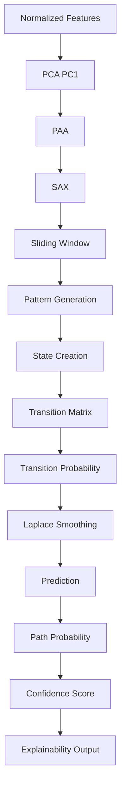
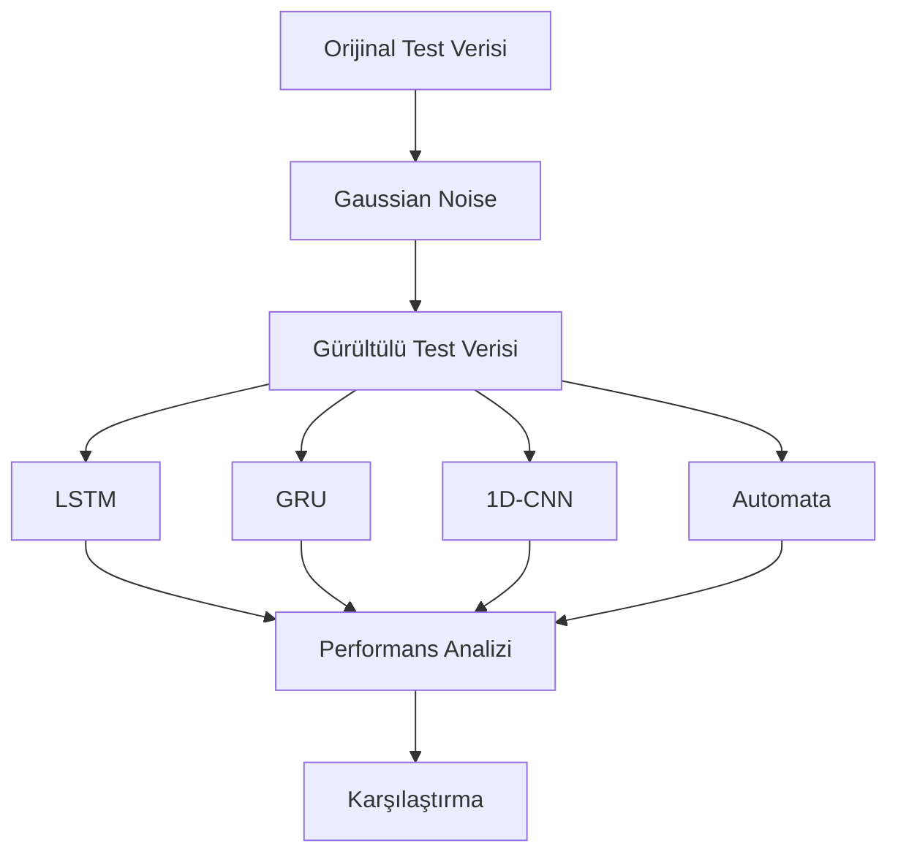
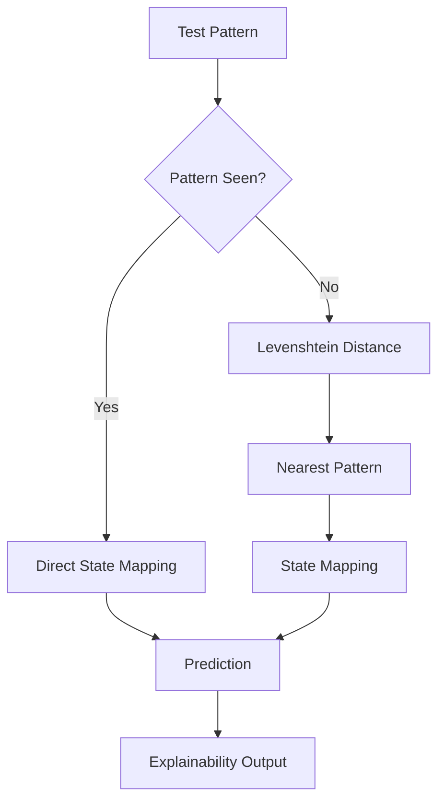

# YAZLAB2 - Açıklanabilir Zaman Serisi Analizi

---

## Proje Özeti

Bu projede zaman serileri üzerinde **anomali tespiti (Anomaly Detection)** gerçekleştirilmiştir.

Çalışmanın temel amacı, yüksek performans sağlayabilen ancak karar mekanizması doğrudan yorumlanamayan **Deep Learning tabanlı black-box modeller** ile karar sürecini açıklayabilen **Probabilistic Automata tabanlı açıklanabilir yaklaşımı** performans, dayanıklılık ve yorumlanabilirlik açısından karşılaştırmaktır.

Geliştirilen sistem yalnızca anomali tespiti yapmakla kalmamakta, aynı zamanda verdiği kararların nedenlerini state, pattern ve transition seviyesinde açıklayabilmektedir.

---

## Ekip

| Ad Soyad | Öğrenci No |
|-----------|-----------|
| Yasemin ATİŞ | 231307023 |
| Şenay CENGİZ | 231307027 |

---

# Proje Amacı

Bu çalışma kapsamında zaman serisi anomaly detection problemi üzerinde farklı modelleme yaklaşımları karşılaştırılmıştır.

Amaç yalnızca yüksek doğruluk elde etmek değil, aynı zamanda model kararlarının nasıl üretildiğini açıklayabilen yorumlanabilir bir yapı geliştirmektir.

Bu doğrultuda hem Deep Learning tabanlı yöntemler hem de açıklanabilir bir Probabilistic Automata yaklaşımı kullanılmıştır.

---

# Kullanılan Yaklaşımlar

## Deep Learning Modelleri

### LSTM

Long Short-Term Memory (LSTM), zaman serilerindeki uzun dönem bağımlılıkları öğrenebilen recurrent neural network yapısıdır. Geçmiş bilgileri hafızasında tutarak zamansal örüntüleri modelleyebilmektedir.

### GRU

Gated Recurrent Unit (GRU), LSTM'e benzer şekilde zamansal bağımlılıkları öğrenebilen ancak daha az parametre içerdiği için daha hızlı eğitilebilen bir recurrent neural network modelidir.

### 1D-CNN

1 Boyutlu Convolutional Neural Network (1D-CNN), zaman serileri üzerindeki yerel örüntüleri öğrenerek anomali tespiti gerçekleştiren convolutional tabanlı bir derin öğrenme modelidir.

---

## Açıklanabilir Yaklaşım

Probabilistic Automata modeli oluşturulurken aşağıdaki yöntemler kullanılmıştır:

- PCA (Principal Component Analysis)
- PAA (Piecewise Aggregate Approximation)
- SAX (Symbolic Aggregate approXimation)
- Sliding Window
- Probabilistic Automata
- Levenshtein Distance
- Explainability Analysis

Bu yapı sayesinde model yalnızca tahmin üretmekle kalmayıp, tahminin hangi pattern ve state geçişlerinden kaynaklandığını da açıklayabilmektedir.

---

# Kullanılan Veri Setleri

| Veri Seti | Açıklama |
|------------|------------|
| BATADAL Training Dataset 2 | Su dağıtım sistemi sensör verileri |
| SKAB | Endüstriyel sensör verileri |

---

# Veri Seti Özeti

| Özellik | BATADAL | SKAB |
|----------|----------:|----------:|
| Satır Sayısı | 4177 | 22474 |
| Kolon Sayısı | 45 | 13 |
| Feature Sayısı | 43 | 8 |
| Label | ATT_FLAG | anomaly |
| Anomaly Oranı | %5.24 | %34.82 |
| Veri Yapısı | Tek CSV | Çoklu CSV |
| Bölme Yöntemi | Zaman Sıralı Split | GroupKFold |

---

# Sistem Mimarisi

Proje modüler bir Python mimarisi üzerine geliştirilmiştir.

```text
src/
├── preprocessing_pipeline.py
├── prepare_skab_dataset.py
├── pca_transform.py
├── paa_transform.py
├── sax_transform.py
├── sliding_window.py
├── automata_builder.py
├── transition_analysis.py
├── automata_predict.py
├── unseen_mapper.py
├── train_lstm.py
├── train_gru.py
├── train_cnn.py
├── evaluate_normal_data.py
├── evaluate_noisy_deep_learning.py
├── evaluate_noisy_automata.py
├── evaluate_unseen_deep_learning.py
├── evaluate_unseen_automata.py
├── parameter_analysis.py
├── cross_dataset_analysis.py
├── cross_dataset_deep_learning.py
├── statistical_analysis.py
├── generate_explainability_outputs.py
└── generate_visualizations.py
```

Bu yapı sayesinde veri hazırlama, model eğitimi, deney çalıştırma, analiz ve görselleştirme süreçleri birbirinden bağımsız ve tekrar kullanılabilir şekilde tasarlanmıştır.

---

# Merkezi Konfigürasyon Yapısı

Projedeki tüm temel parametreler `config/config.py` dosyasında merkezi olarak tutulmaktadır. Bu yapı sayesinde deneylerin tekrarlanabilirliği sağlanmış ve tüm pipeline bileşenleri aynı parametreleri kullanmıştır.

Önemli konfigürasyon parametreleri aşağıda verilmiştir:

| Parametre | Değer |
|------------|------------:|
| RANDOM_SEED | 42 |
| WINDOW_SIZE | 4 |
| ALPHABET_SIZE | 3 |
| PAA_SEGMENTS | 4 |
| BATCH_SIZE | 32 |
| LEARNING_RATE | 0.001 |
| EPOCHS | 50 |
| EARLY_STOPPING_PATIENCE | 5 |
| UNSEEN_DISTANCE_THRESHOLD | 1 |

Parametre duyarlılık analizlerinde aşağıdaki seçenekler kullanılmıştır:

```python
WINDOW_SIZE_OPTIONS = [3, 4, 5, 6]
ALPHABET_SIZE_OPTIONS = [3, 4, 5, 6]
SEEDS = [42, 123, 2026, 7, 999]
```

Bu sayede parametre değişiklikleri tüm deney scriptleri tarafından ortak şekilde kullanılabilmiştir.

---

# Kurulum

Projeyi çalıştırmak için aşağıdaki adımlar uygulanmalıdır.

```bash
git clone https://github.com/senaycengiz/yazlab2-aciklanabilir-zaman-serisi-analizi.git

cd yazlab2-aciklanabilir-zaman-serisi-analizi

python -m venv .venv

source .venv/bin/activate

pip install -r requirements.txt
```

Veri setleri GitHub deposuna dahil edilmemiştir. SKAB ve BATADAL veri setlerinin ilgili klasörlere manuel olarak eklenmesi gerekmektedir.

---

# Kullanılan Teknolojiler

Proje geliştirme sürecinde aşağıdaki teknolojiler ve kütüphaneler kullanılmıştır.

| Teknoloji | Kullanım Amacı |
|------------|------------|
| Python | Temel geliştirme dili |
| Pandas | Veri işleme |
| NumPy | Sayısal hesaplamalar |
| Scikit-Learn | PCA, StandardScaler ve metrik hesaplamaları |
| PyTorch | LSTM, GRU ve 1D-CNN modelleri |
| Matplotlib | Grafik üretimi |
| Seaborn | Isı haritaları ve görselleştirme |
| NetworkX | Automata state diagram oluşturma |
| Levenshtein | Unseen pattern eşleme |
| Pytest | Birim testler |

---

# Veri Ön İşleme Süreci

Modelleme öncesinde hem Deep Learning hem de Probabilistic Automata tarafında veri ön işleme adımları uygulanmıştır.

## Ortak Ön İşleme Adımları

1. Veri setinin okunması
2. Feature ve label ayrımı
3. Train / Validation / Test bölünmesi
4. StandardScaler ile normalizasyon
5. Veri sızıntısını önlemek için yalnızca train üzerinde fit işlemi uygulanması

---

## Deep Learning Pipeline

```text
Raw Data
   │
   ▼
Train/Test Split
   │
   ▼
Normalization
   │
   ▼
Sequence Generation
   │
   ▼
LSTM / GRU / CNN
```

Deep Learning modelleri çok değişkenli sensör verileri üzerinde doğrudan çalışmaktadır.

---

## Probabilistic Automata Pipeline

```text
Raw Data
   │
   ▼
Normalization
   │
   ▼
PCA (PC1)
   │
   ▼
PAA
   │
   ▼
SAX
   │
   ▼
Sliding Window
   │
   ▼
Pattern Generation
   │
   ▼
State Generation
   │
   ▼
Transition Analysis
   │
   ▼
Prediction
   │
   ▼
Explainability
```

Automata modeli için PCA yalnızca eğitim verisi üzerinde öğrenilmiş ve tüm dönüşümler eğitimden elde edilen parametreler kullanılarak uygulanmıştır.

---

# Veri Bölme Stratejisi

Veri sızıntısını önlemek ve gerçek dünya senaryolarını daha doğru temsil etmek amacıyla veri setlerine özel bölme stratejileri uygulanmıştır.

---

## BATADAL

BATADAL veri setinde zaman serisi yapısının korunabilmesi için kronolojik bölme uygulanmıştır.

| Bölüm | Oran | Satır |
|---------|---------:|---------:|
| Train | %60 | 2506 |
| Validation | %20 | 835 |
| Test | %20 | 836 |

### Uygulanan Kurallar

- Shuffle uygulanmamıştır.
- Zaman sırası korunmuştur.
- Normalizasyon yalnızca train üzerinde fit edilmiştir.
- PCA yalnızca train üzerinde fit edilmiştir.
- Validation ve test verileri yalnızca transform edilmiştir.

---

## SKAB

SKAB veri setinde aynı dosyaya ait kayıtların hem eğitim hem test tarafına düşmesini önlemek amacıyla GroupKFold yaklaşımı uygulanmıştır.

Gruplama değişkeni:

```text
source_file
```

olarak belirlenmiştir.

| Fold | Train | Test |
|---------|---------:|---------:|
| Fold 1 | 17962 | 4512 |
| Fold 2 | 17981 | 4493 |
| Fold 3 | 17982 | 4492 |
| Fold 4 | 18040 | 4434 |
| Fold 5 | 17931 | 4543 |

### Uygulanan Kurallar

- Aynı CSV dosyası hem train hem test tarafında yer almamaktadır.
- Veri sızıntısı engellenmiştir.
- Her fold bağımsız değerlendirilmiştir.
- Sonuçlar fold ortalamaları şeklinde raporlanmıştır.

---

# Veri Sızıntısını Önleme Yaklaşımı

Proje boyunca aşağıdaki kurallar uygulanmıştır:

| İşlem | Uygulama |
|---------|---------|
| StandardScaler | Yalnızca train üzerinde fit edilmiştir |
| PCA | Yalnızca train üzerinde fit edilmiştir |
| Validation Dönüşümü | Train parametreleri ile transform |
| Test Dönüşümü | Train parametreleri ile transform |
| SKAB Split | source_file bazlı GroupKFold |
| BATADAL Split | Zaman sıralı ayrım |

Bu yaklaşım sayesinde test verisinin eğitim sürecine doğrudan veya dolaylı şekilde sızması engellenmiştir.

---
# Kullanılan Modeller

Bu proje kapsamında Deep Learning tabanlı black-box modeller ile açıklanabilir bir Probabilistic Automata yaklaşımı karşılaştırılmıştır.

---

### Kullanılan Eğitim Parametreleri

| Parametre | Değer |
|------------|------------:|
| Epoch | 50 |
| Batch Size | 32 |
| Learning Rate | 0.001 |
| Early Stopping Patience | 5 |
| Optimizer | Adam |
| Loss Function | BCEWithLogitsLoss |
| Random Seed | 42 |

Deep Learning modelleri normalize edilmiş çok değişkenli sensör verileri üzerinde eğitilmiş ve Accuracy, Precision, Recall ve F1-score metrikleri ile değerlendirilmiştir.

---

## Açıklanabilir Model

| Model | Tür | Açıklama |
|---------|---------|---------|
| Probabilistic Automata | Explainable AI | State ve transition probability tabanlı açıklanabilir anomali tespit modeli |

Probabilistic Automata yaklaşımı, zaman serisini sembolik örüntülere dönüştürerek karar üretmektedir. Model yalnızca anomali tahmini yapmakla kalmamakta, aynı zamanda bu kararın hangi durum geçişleri ve hangi olasılıklar üzerinden oluştuğunu da açıklayabilmektedir.

---

# Açıklanabilir Automata Yaklaşımı

Bu çalışmada çok değişkenli sensör verileri önce normalize edilmiş, ardından PCA ile tek boyuta indirgenmiştir. İlk temel bileşen (PC1) kullanılarak zaman serisi sembolik forma dönüştürülmüş ve Probabilistic Automata modeli oluşturulmuştur.

### Kullanılan Temel Parametreler

| Parametre | Değer |
|------------|------------:|
| PCA Component | PC1 |
| PAA Segments | 4 |
| Window Size | 4 |
| Alphabet Size | 3 |
| Unseen Distance Threshold | 1 |

---

## Dönüşüm Zinciri

```text
Normalize Data
      │
      ▼
PCA (PC1)
      │
      ▼
PAA
      │
      ▼
SAX
      │
      ▼
Sliding Window
      │
      ▼
Pattern Generation
      │
      ▼
State Creation
      │
      ▼
Transition Matrix
      │
      ▼
Transition Probability
      │
      ▼
Prediction
      │
      ▼
Explainability
```

---

## Automata Model Akışı



---

## Transition Probability Hesaplama

Bir durumdan başka bir duruma geçiş olasılığı aşağıdaki şekilde hesaplanmaktadır:

```text
P(Si → Sj)
=
Transition Count(Si → Sj)
/
Total Outgoing Transitions(Si)
```

Sıfır olasılık problemini azaltmak amacıyla Laplace Smoothing uygulanmıştır.

---

## Açıklanabilirlik Çıktıları

Automata modeli aşağıdaki bilgileri üretebilmektedir:

- State bilgisi
- Pattern bilgisi
- State geçişleri
- Transition probability değerleri
- Path probability
- Log path probability
- Average transition probability
- Confidence score
- Unseen pattern eşlemeleri
- Nihai karar (Normal / Anomaly)

Bu yapı sayesinde model yalnızca bir tahmin üretmekle kalmamakta, tahminin hangi geçişler ve hangi olasılıklar sonucunda oluştuğunu da açıklayabilmektedir.

---

# Unseen Pattern Yönetimi

Probabilistic Automata modeli, eğitim sırasında görülmeyen sembolik örüntüleri (unseen patterns) yönetebilmek için Levenshtein Distance tabanlı bir eşleme mekanizması kullanmaktadır.

Bu mekanizma sayesinde model, daha önce hiç karşılaşmadığı pattern'lar için de açıklanabilir ve deterministik kararlar üretebilmektedir.

---

## İşleyiş

1. Test sırasında gelen pattern eğitim sözlüğünde aranır.
2. Pattern sözlükte bulunuyorsa doğrudan ilgili state kullanılır.
3. Pattern sözlükte bulunmuyorsa **unseen** olarak işaretlenir.
4. Eğitim sözlüğündeki tüm pattern'lar ile Levenshtein Distance hesaplanır.
5. En küçük edit distance değerine sahip pattern bulunur.
6. Gelen pattern bu state'e eşlenir.
7. Transition analizi ve tahmin süreci eşlenen state üzerinden devam eder.
8. Açıklanabilirlik çıktısında eşleme bilgisi raporlanır.

---

## Örnek

```text
Train Pattern : abca

Incoming Pattern : abcb

Levenshtein Distance = 1

abcb → abca
```

Bu örnekte test sırasında gelen `abcb` pattern'i eğitim sırasında görülmemiştir. Sistem en yakın pattern olarak `abca` state'ini belirleyerek tahmin sürecine devam etmektedir.

---

# Explainability Çıktıları

Probabilistic Automata modeli yalnızca anomali kararı üretmekle kalmamakta, aynı zamanda kararın hangi state geçişleri ve hangi olasılıklar sonucunda oluştuğunu da raporlayabilmektedir.

Üretilen açıklama çıktılarında aşağıdaki bilgiler yer almaktadır:

- State bilgisi
- Pattern bilgisi
- Pattern durumu (seen / unseen)
- Eşlenen pattern bilgisi
- Levenshtein distance değeri
- Transition listesi
- Transition probability değerleri
- Path probability
- Log path probability
- Average transition probability
- Confidence score
- Nihai karar (Normal / Anomaly)

---

## Örnek Açıklama Çıktısı

```json
{
  "time_step": 1,
  "state": "abca",
  "pattern": "abcb",
  "status": "unseen",
  "mapped_to": "abca",
  "levenshtein_distance": 1,
  "transitions": [
    {
      "from": "abca",
      "to": "bcab",
      "probability": 0.2188
    }
  ],
  "path_probability": 0.2188,
  "confidence_score": 0.2188,
  "decision": "anomaly"
}
```

---

## Açıklanabilirlik Avantajları

Probabilistic Automata modeli aşağıdaki nedenlerle açıklanabilir bir yapı sunmaktadır:

- Karar süreci state bazında takip edilebilir.
- Hangi pattern'in anomaliye neden olduğu görülebilir.
- State geçişleri ve geçiş olasılıkları incelenebilir.
- Unseen pattern eşlemeleri açık şekilde raporlanabilir.
- Confidence score ile karar güveni yorumlanabilir.
- Transition probability yapısı görselleştirilebilir.

Bu özellikler sayesinde model yalnızca bir tahmin üretmekle kalmaz, aynı zamanda bu tahminin neden üretildiğini de açıklayabilir.

---

# Testler

Proje kapsamında veri ön işleme, PCA dönüşümü, PAA-SAX dönüşümleri, automata oluşturma, transition analizi, unseen pattern yönetimi, açıklanabilirlik modülü ve derin öğrenme bileşenleri için kapsamlı birim testler geliştirilmiştir.

Tüm testleri çalıştırmak için:

```bash
python -m pytest
```

Belirli testleri çalıştırmak için:

```bash
python -m pytest tests/test_automata_predict.py

python -m pytest tests/test_automata_prediction_accuracy.py

python -m pytest tests/test_explainability.py
```

---

## Test Sonuçları

Son doğrulama çalıştırmasında tüm testler başarıyla tamamlanmıştır.

| Ölçüt | Değer |
|--------|--------:|
| Toplam Test Sayısı | 47 |
| Başarılı Test Sayısı | 47 |
| Başarı Oranı | %100 |

<p align="center">

</p>

*Pytest sonuç ekranı (47/47 test başarılı).*

---
# Deney Sonuçları ve Karşılaştırmalı Analiz Tabloları
---
Bu bölümde proje kapsamında gerçekleştirilen deneylerin özet sonuçları sunulmaktadır. Sonuçlar normal veri, gürültülü veri, unseen pattern senaryoları, parametre duyarlılık analizleri ve cross-dataset deneylerinden elde edilmiştir.
---
## Tablo 1: Model Performansı ve Stabilitesi (F1-score ± Std)

| Model | SKAB | BATADAL |
|---------|---------|---------|
| LSTM | 0.149 ± 0.167 | 0.000 ± 0.000 |
| GRU | 0.187 ± 0.181 | 0.000 ± 0.000 |
| 1D-CNN | 0.215 ± 0.162 | 0.000 ± 0.000 |
| Automata | 0.137 ± 0.105 | 0.381 ± 0.000 |
---
### Değerlendirme

- SKAB veri setinde en yüksek F1-score değeri 1D-CNN modeli tarafından elde edilmiştir.

- GRU modeli ikinci sırada yer almıştır.

- Automata modeli SKAB üzerinde derin öğrenme modellerinin gerisinde kalmıştır.

- BATADAL veri setinde sınıf dengesizliği nedeniyle LSTM, GRU ve CNN modelleri anomaly sınıfını tespit edememiştir.

- Automata modeli BATADAL veri setinde F1-score = 0.381 değeri ile en başarılı sonucu üretmiştir.
---
## Tablo 2: Gürültü Etkisi ve Unseen Senaryo Analizi

| Veri Seti | Model | Orijinal F1 | Gürültülü F1 | Det. Rate | Map. Acc. |
|------------|---------|------------:|-------------:|----------:|----------:|
| SKAB | LSTM | 0.149 | 0.179 | - | - |
| SKAB | GRU | 0.187 | 0.160 | - | - |
| SKAB | 1D-CNN | 0.215 | 0.422 | - | - |
| SKAB | Automata | 0.137 | 0.237 | 1.000 | 1.000 |
| BATADAL | LSTM | 0.000 | 0.000 | - | - |
| BATADAL | GRU | 0.000 | 0.000 | - | - |
| BATADAL | 1D-CNN | 0.000 | 0.000 | - | - |
| BATADAL | Automata | 0.381 | 0.182 | 1.000 | 1.000 |

### Tablo 2 Değerlendirmesi

Bu tabloda modellerin gürültülü veri ve eğitim sırasında görülmeyen örüntüler karşısındaki davranışları karşılaştırılmıştır.

Deep Learning modelleri için unseen pattern yönetimi doğrudan pattern eşleme mekanizmasına dayanmadığından Det. Rate ve Map. Acc. değerleri raporlanmamıştır. Bu nedenle ilgili alanlar `-` ile gösterilmiştir.

SKAB veri setinde gürültülü senaryoda en yüksek F1-score değeri 1D-CNN modeli tarafından elde edilmiştir. CNN modeli özellikle recall değerindeki artış sayesinde gürültülü veri üzerinde daha yüksek F1-score üretmiştir.

Probabilistic Automata modeli SKAB veri setinde normal senaryoda F1-score = 0.137 üretirken gürültülü senaryoda F1-score = 0.237 elde etmiştir. Unseen senaryoda ise Detection Rate = 1.000 ve Mapping Accuracy = 1.000 değerlerine ulaşmıştır.

BATADAL veri setinde Deep Learning modelleri sınıf dengesizliği nedeniyle anomaly sınıfını tespit edememiştir. Automata modeli ise normal senaryoda F1-score = 0.381, gürültülü senaryoda F1-score = 0.182 elde etmiş ve unseen pattern senaryosunda tüm örüntüleri başarıyla tespit edip eşleyebilmiştir.

Bu sonuçlar, Probabilistic Automata yaklaşımının özellikle unseen pattern yönetimi ve açıklanabilir karar üretimi açısından önemli avantajlar sunduğunu göstermektedir.

---
## Tablo 3: Veri Setleri Arası Genellenebilirlik (Cross-Dataset Analysis)

| Eğitim Veri Seti | Test Veri Seti | Model | Accuracy | Precision | Recall | F1-score |
|------------------|----------------|--------|----------:|----------:|----------:|----------:|
| SKAB | BATADAL | LSTM | 0.751 ± 0.051 | 0.150 ± 0.015 | 0.333 ± 0.067 | 0.204 ± 0.013 |
| SKAB | BATADAL | GRU | 0.702 ± 0.020 | 0.137 ± 0.003 | 0.398 ± 0.038 | 0.203 ± 0.006 |
| SKAB | BATADAL | CNN | 0.737 ± 0.038 | 0.140 ± 0.009 | 0.335 ± 0.057 | 0.195 ± 0.006 |
| SKAB | BATADAL | Automata | 0.519 | 0.104 | 0.477 | 0.170 |
| BATADAL | SKAB | LSTM | 0.652 ± 0.009 | 0.000 ± 0.000 | 0.000 ± 0.000 | 0.000 ± 0.000 |
| BATADAL | SKAB | GRU | 0.652 ± 0.009 | 0.000 ± 0.000 | 0.000 ± 0.000 | 0.000 ± 0.000 |
| BATADAL | SKAB | CNN | 0.652 ± 0.009 | 0.000 ± 0.000 | 0.000 ± 0.000 | 0.000 ± 0.000 |
| BATADAL | SKAB | Automata | 0.590 ± 0.049 | 0.362 ± 0.101 | 0.170 ± 0.058 | 0.222 ± 0.049 |
---
### Tablo 3 Değerlendirmesi

Cross-dataset deneylerinde modeller bir veri setinde eğitilip farklı bir veri setinde test edilmiştir. Amaç modellerin veri setine bağımlılığını ve genellenebilirlik yeteneklerini incelemektir.

SKAB üzerinde eğitilen Deep Learning modelleri BATADAL veri setinde sınırlı da olsa anlamlı sonuçlar üretmiştir. En yüksek Accuracy değeri LSTM modeli tarafından (0.751 ± 0.051), en yüksek Recall değeri ise GRU modeli tarafından (0.398 ± 0.038) elde edilmiştir.

Probabilistic Automata modeli SKAB → BATADAL geçişinde F1-score = 0.170 elde etmiştir. Bu sonuç Deep Learning modellerinin gerisinde kalmasına rağmen modelin açıklanabilirlik avantajı korunmuştur.

BATADAL üzerinde eğitilen modeller SKAB veri setine aktarıldığında tüm Deep Learning modelleri anomaly sınıfını tespit edememiş ve F1-score = 0.000 üretmiştir. Buna karşılık Automata modeli F1-score = 0.222 ± 0.049 elde ederek iki veri seti arasında daha dengeli bir performans göstermiştir.

Sonuçlar, sensör yapıları ve veri dağılımları arasındaki farklılıkların model performansını önemli ölçüde etkilediğini göstermektedir. Veri setleri arası doğrudan transfer başarısı genel olarak düşük kalmıştır.
---
## Tablo 4: Window Size Parametre Duyarlılık Analizi

### SKAB Veri Seti

| Window Size | Accuracy (Mean ± Std) | F1-score (Mean ± Std) | State Count | Transition Density |
|------------:|----------------------:|----------------------:|------------:|-------------------:|
| 3 | 0.608 ± 0.022 | 0.125 ± 0.065 | 27.0 | 0.0977 |
| 4 | 0.600 ± 0.032 | 0.137 ± 0.105 | 71.2 | 0.0317 |
| 5 | 0.594 ± 0.047 | 0.130 ± 0.115 | 161.0 | 0.0128 |
| 6 | 0.588 ± 0.054 | 0.129 ± 0.128 | 330.4 | 0.0056 |

### BATADAL Veri Seti

| Window Size | Accuracy | F1-score | State Count | Transition Density |
|------------:|----------:|----------:|------------:|-------------------:|
| 3 | 0.798 | 0.067 | 26 | 0.1050 |
| 4 | 0.780 | 0.052 | 71 | 0.0327 |
| 5 | 0.771 | 0.104 | 165 | 0.0115 |
| 6 | 0.745 | 0.124 | 312 | 0.0052 |

### Tablo 4 Değerlendirmesi

Window Size arttıkça state sayısında üstel büyüme gözlenmiştir. SKAB veri setinde state sayısı Window Size=3 için 27 iken Window Size=6 için 330.4 seviyesine ulaşmıştır.

Buna karşılık transition density sürekli azalmıştır. Daha büyük pencere boyutları daha karmaşık automata yapıları üretmesine rağmen performans artışı sağlamamıştır.

SKAB veri setinde en dengeli sonuçlar Window Size=4 için elde edilmiştir. Bu nedenle proje boyunca varsayılan pencere boyutu olarak Window Size=4 kullanılmıştır.

---

### SKAB

<p align="center">

</p>

---

### BATADAL

<p align="center">

</p>
---

## Tablo 5: Alphabet Size Parametre Duyarlılık Analizi

### SKAB Veri Seti

| Alphabet Size | Accuracy (Mean ± Std) | F1-score (Mean ± Std) | State Count |
|--------------:|----------------------:|----------------------:|------------:|
| 3 | 0.600 ± 0.032 | 0.137 ± 0.105 | 71.2 |
| 4 | 0.615 ± 0.032 | 0.148 ± 0.075 | 130.6 |
| 5 | 0.613 ± 0.036 | 0.170 ± 0.090 | 275.2 |
| 6 | 0.600 ± 0.033 | 0.157 ± 0.081 | 474.4 |

### BATADAL Veri Seti

| Alphabet Size | Accuracy | F1-score | State Count |
|--------------:|----------:|----------:|------------:|
| 3 | 0.780 | 0.052 | 71 |
| 4 | 0.785 | 0.197 | 169 |
| 5 | 0.734 | 0.147 | 334 |
| 6 | 0.623 | 0.137 | 522 |

### Tablo 5 Değerlendirmesi

Alphabet Size arttıkça sembolik temsilin çözünürlüğü yükselmiş ve state sayısı önemli ölçüde artmıştır.

SKAB veri setinde en yüksek F1-score değeri Alphabet Size=5 için (0.170 ± 0.090) elde edilmiştir. Ancak state sayısı da 275.2 seviyesine yükselmiştir.

Alphabet Size=6 durumunda model karmaşıklığı artmasına rağmen performans iyileşmesi sınırlı kalmıştır. Bu nedenle doğruluk ve model karmaşıklığı arasındaki denge göz önünde bulundurularak varsayılan değer olarak Alphabet Size=3 tercih edilmiştir.
---

### SKAB

<p align="center">

</p>

---

### BATADAL

<p align="center">

</p>


---
## Tablo 6: Modellerin Çalışma Süresi (Runtime) Karşılaştırması

| Model | Training Time (sn) | Inference Time (sn) |
|--------|-------------------:|--------------------:|
| LSTM | 67.658 | - |
| GRU | 102.948 | - |
| 1D-CNN | 91.134 | - |
| Automata | - | 2.103 |

---
### Tablo 6 Değerlendirmesi
Tablo 6'da modellerin çalışma süreleri karşılaştırılmıştır. Derin öğrenme tabanlı modeller için eğitim (training) süreleri, probabilistic automata modeli için ise çıkarım (inference) süresi raporlanmıştır. Sonuçlara göre en kısa eğitim süresi 67.658 saniye ile LSTM modelinde elde edilirken, GRU modeli 102.948 saniye ile en yüksek eğitim maliyetine sahip olmuştur. 1D-CNN modeli ise 91.134 saniyede eğitimini tamamlamıştır. Probabilistic automata yaklaşımı yalnızca 2.103 saniyelik çıkarım süresiyle çalışmış ve diğer yöntemlere kıyasla oldukça düşük hesaplama maliyeti göstermiştir. Bu sonuçlar, önerilen automata tabanlı yaklaşımın yalnızca açıklanabilirlik açısından değil, aynı zamanda çalışma süresi ve hesaplama verimliliği açısından da avantaj sağladığını göstermektedir.

---

# Normal Veri Senaryosu Sonuçları

Bu deneyde modeller herhangi bir gürültü eklenmeden orijinal test verileri üzerinde değerlendirilmiştir.

---


## SKAB Sonuçları (5 Fold Ortalama)

| Model | Accuracy | Precision | Recall | F1-score |
|---------|---------:|---------:|---------:|---------:|
| LSTM | 0.674 | 0.668 | 0.093 | 0.149 |
| GRU | 0.676 | 0.592 | 0.122 | 0.187 |
| 1D-CNN | 0.678 | 0.637 | 0.139 | 0.215 |
| Automata | 0.600 | 0.276 | 0.104 | 0.137 |

---

## BATADAL Sonuçları

| Model | Accuracy | Precision | Recall | F1-score |
|---------|---------:|---------:|---------:|---------:|
| LSTM | 0.904 | 0.000 | 0.000 | 0.000 |
| GRU | 0.904 | 0.000 | 0.000 | 0.000 |
| 1D-CNN | 0.904 | 0.000 | 0.000 | 0.000 |
| Automata | 0.671 | 0.308 | 0.500 | 0.381 |

---

# Confusion Matrix

Aşağıdaki confusion matrix örneği Probabilistic Automata modelinin normal veri senaryosundaki sınıflandırma performansını göstermektedir.

<p align="center">

</p>

---

# Precision-Recall Curve

Precision ve Recall arasındaki ilişki aşağıdaki grafikte gösterilmektedir.

<p align="center">

</p>

---

## Normal Veri Sonuçlarının Değerlendirilmesi

Elde edilen sonuçlar incelendiğinde Deep Learning modellerinin özellikle SKAB veri setinde daha yüksek accuracy ve F1-score değerleri ürettiği görülmektedir.

SKAB veri setinde en yüksek F1-score değeri 1D-CNN modeli tarafından elde edilmiştir. CNN modeli F1-score = 0.215 değeri ile en başarılı model olmuştur. CNN modelini sırasıyla GRU, LSTM ve Automata takip etmiştir.

BATADAL veri setinde ise sınıf dengesizliği nedeniyle LSTM, GRU ve 1D-CNN modelleri yüksek accuracy üretmelerine rağmen anomaly sınıfını yakalayamamıştır. Bu nedenle precision, recall ve F1-score değerleri 0.000 olarak gerçekleşmiştir.

Probabilistic Automata modeli SKAB veri setinde Deep Learning modellerinin gerisinde kalmasına rağmen BATADAL veri setinde anomaly sınıfını daha dengeli yakalayarak F1-score = 0.381 değerine ulaşmıştır.

Bu sonuçlar, model performansının veri setinin anomali oranı ve veri yapısından doğrudan etkilendiğini göstermektedir. Deep Learning modelleri SKAB üzerinde daha başarılı olurken, Automata yaklaşımı özellikle yorumlanabilirlik ve anomaly sınıfını açıklanabilir şekilde tespit etme açısından avantaj sağlamaktadır.

---

# Gürültü (Noise) Senaryosu

Modellerin veri bozulmalarına karşı dayanıklılığını ölçmek amacıyla test verilerine Gaussian Noise eklenmiştir.

Bu deneyde eğitim verileri değiştirilmemiş, yalnızca test verilerine belirli seviyede Gaussian Noise uygulanmıştır. Amaç modellerin daha gerçekçi ve gürültülü ortamlardaki davranışlarını incelemektir.

---

## Uygulanan Yaklaşım

- Eğitim verileri değiştirilmemiştir.
- Modeller yeniden eğitilmemiştir.
- Yalnızca test verilerine Gaussian Noise eklenmiştir.
- Deep Learning ve Automata modelleri aynı gürültülü veri üzerinde değerlendirilmiştir.
- Accuracy, Precision, Recall ve F1-score değişimleri incelenmiştir.

---

## Gürültü(Noise) Senaryosu Akışı



---

## SKAB Gürültü(Noise) Sonuçları

| Model | Accuracy | Precision | Recall | F1-score |
|---------|---------:|---------:|---------:|---------:|
| LSTM | 0.655 | 0.441 | 0.110 | 0.179 |
| GRU | 0.655 | 0.412 | 0.099 | 0.160 |
| 1D-CNN | 0.403 | 0.355 | 0.519 | 0.422 |
| Automata | 0.516 | 0.265 | 0.233 | 0.237 |

---

## BATADAL Gürültü(Noise) Sonuçları

| Model | Accuracy | Precision | Recall | F1-score |
|---------|---------:|---------:|---------:|---------:|
| LSTM | 0.000 | 0.000 | 0.000 | 0.000 |
| GRU | 0.000 | 0.000 | 0.000 | 0.000 |
| 1D-CNN | 0.000 | 0.000 | 0.000 | 0.000 |
| Automata | 0.285 | 0.103 | 0.767 | 0.182 |

---

## Gürültü(Noise) Senaryosu Değerlendirmesi

Gaussian Noise eklenmesi sonrasında tüm modellerde performans değişimleri gözlemlenmiştir.
SKAB veri setinde 1D-CNN modeli yüksek recall değeri (0.519) sayesinde en yüksek F1-score değerini (0.422) üretmiştir. LSTM ve GRU modellerinde ise gürültü sonrasında performans düşüşü gözlemlenmiştir.
Probabilistic Automata modeli SKAB veri setinde F1-score = 0.237 değeri elde etmiş ve sembolik temsil yapısı sayesinde belirli seviyede dayanıklılık göstermiştir.
BATADAL veri setinde Deep Learning modelleri anomali sınıfını yakalayamazken, Automata modeli Recall = 0.767 değeri ile anomalilerin önemli bir kısmını tespit edebilmiştir.
Bu sonuçlar, gürültünün özellikle derin öğrenme modellerinin karar mekanizmasını etkileyebildiğini; Automata yaklaşımının ise state ve transition tabanlı yapısı sayesinde belirli seviyede dayanıklılık sağlayabildiğini göstermektedir.

---

# Unseen Veri Senaryosu

Bu deneyde eğitim sırasında görülmeyen yeni pattern'lar oluşturulmuştur.

Amaç, Automata modelinin daha önce karşılaşmadığı örüntüler karşısındaki davranışını incelemektir.

Modelin unseen pattern'ları yönetebilmesi için Levenshtein Distance tabanlı eşleme mekanizması kullanılmıştır.

---

## Unseen Senaryosu Akışı



---

## Unseen Veri Seti Özeti

| Veri Seti | Unseen Ratio | Açıklama |
|------------|------------:|------------|
| SKAB | 1.00 | Test patternlarının tamamı eğitimde görülmemiştir |
| BATADAL | 1.00 | Test patternlarının tamamı eğitimde görülmemiştir |

---

## Unseen Pattern Eşleme Sonuçları

| Veri Seti | Pattern Yönetimi | Eşleme Yöntemi | Karar Üretimi |
|------------|------------|------------|------------|
| SKAB | Başarılı | Levenshtein Distance | Devam etti |
| BATADAL | Başarılı | Levenshtein Distance | Devam etti |

---

## Açıklanabilirlik Çıktıları

| Veri Seti | Unseen Pattern Tespiti | Mapping Bilgisi | Transition Açıklaması | Confidence Score |
|------------|------------|------------|------------|------------|
| SKAB | Var | Var | Var | Var |
| BATADAL | Var | Var | Var | Var |

---

## Örnek Unseen Pattern Eşlemesi

| Gelen Pattern | En Yakın Eğitim Pattern'ı | Levenshtein Distance |
|--------------|--------------------------|----------------------:|
| abdc | abbc | 1 |
| cbad | cbcd | 1 |
| acbd | acad | 1 |

---

## Değerlendirme

- Eğitim sırasında görülmeyen pattern'lar başarıyla tespit edilmiştir.
- Levenshtein Distance kullanılarak en yakın eğitim pattern'ına eşleme yapılmıştır.
- State geçişleri korunmuştur.
- Karar süreci kesintiye uğramadan devam etmiştir.
- Mapping işlemleri explainability çıktılarında raporlanmıştır.
- Model tamamen yeni örüntüler için de açıklanabilir karar üretebilmiştir.

Bu sonuçlar, Probabilistic Automata yaklaşımının unseen pattern durumlarında deterministik ve açıklanabilir davranış sergileyebildiğini göstermektedir.

---

# Explainability Analizi

Probabilistic Automata modelinin en önemli avantajı yalnızca tahmin üretmesi değil, aynı zamanda karar sürecini açıklayabilmesidir.

Model;

- State bilgisi
- Pattern bilgisi
- Transition olasılıkları
- Path probability
- Confidence score
- Unseen pattern eşlemeleri

üreterek kararın nasıl oluştuğunu takip edilebilir hale getirmektedir.

---

## Automata State Diagram

Aşağıdaki grafik eğitim verisinden oluşturulan state yapısını ve state geçişlerini göstermektedir.

<p align="center">

</p>

---

## Transition Probability Heatmap

Geçiş olasılıklarının yoğunluğu aşağıdaki heatmap üzerinde gösterilmektedir.

<p align="center">

</p>

---

## Örnek Açıklanabilirlik Çıktısı

```json
{
  "time_step": 25,
  "state": "abca",
  "pattern": "abca",
  "status": "seen",
  "path_probability": 0.00318,
  "confidence_score": 0.412,
  "decision": "normal"
}
```

Unseen pattern durumunda ise:

```json
{
  "pattern": "abda",
  "status": "unseen",
  "mapped_to": "abca",
  "levenshtein_distance": 1,
  "confidence_score": 0.287,
  "decision": "anomaly"
}
```

---

## Explainability Değerlendirmesi

Automata modeli:

- State bazlı çalışmaktadır.
- Geçiş olasılıklarını raporlayabilmektedir.
- Confidence score üretebilmektedir.
- Unseen pattern'ları açıklayabilmektedir.
- Levenshtein Distance ile pattern eşlemesi yapabilmektedir.
- Karar sürecini JSON çıktıları ile sunabilmektedir.

Bu özellikler deep learning modellerine kıyasla önemli yorumlanabilirlik avantajları sağlamaktadır.

---

# İstatistiksel Analiz

Deneyler aşağıdaki random seed değerleri ile tekrarlanmıştır.

## Kullanılan Seed Değerleri

```text
42
123
2026
7
999
```

---

## Wilcoxon Signed-Rank Testi

Modeller arasındaki performans farklarını incelemek amacıyla Wilcoxon Signed-Rank testi uygulanmıştır.

| Karşılaştırma | Statistic | p-value | Yorum |
|-------------|----------:|---------:|---------|
| LSTM vs GRU | 1.0 | 0.125 | Anlamlı fark yok |
| LSTM vs CNN | 0.0 | 0.0625 | Sınıra yakın |
| GRU vs CNN | 1.0 | 0.125 | Anlamlı fark yok |

---

## Sonuç

- p-value değerleri 0.05'in üzerinde bulunmuştur.
- Modeller arasında istatistiksel olarak anlamlı fark gözlemlenmemiştir.
- Sonuçlar farklı random seed değerlerinde kararlı davranış göstermiştir.

---

# Genel Sonuç

Bu proje kapsamında:

- LSTM
- GRU
- 1D-CNN
- Probabilistic Automata

yaklaşımları zaman serisi anomali tespiti problemi üzerinde karşılaştırılmıştır.

Deep Learning modelleri özellikle SKAB veri setinde daha yüksek performans göstermiştir. CNN modeli SKAB üzerinde en yüksek F1-score değerini üretmiştir.

BATADAL veri setinde sınıf dengesizliği nedeniyle Accuracy değerleri yüksek olmasına rağmen Recall ve F1-score değerleri düşük kalmıştır.

Probabilistic Automata yaklaşımı ise:

- State yapıları
- Transition olasılıkları
- Confidence Score
- Path Probability
- Unseen Pattern Yönetimi
- Levenshtein Distance Eşlemesi
- Explainability Çıktıları

sayesinde karar sürecini açıklanabilir hale getirmiştir.

Sonuç olarak Deep Learning modelleri performans açısından avantaj sağlarken, Probabilistic Automata modeli yorumlanabilirlik açısından önemli avantajlar sunmuştur. Bu çalışma, zaman serisi anomali tespitinde performans ve açıklanabilirlik arasındaki dengeyi göstermektedir.
---
